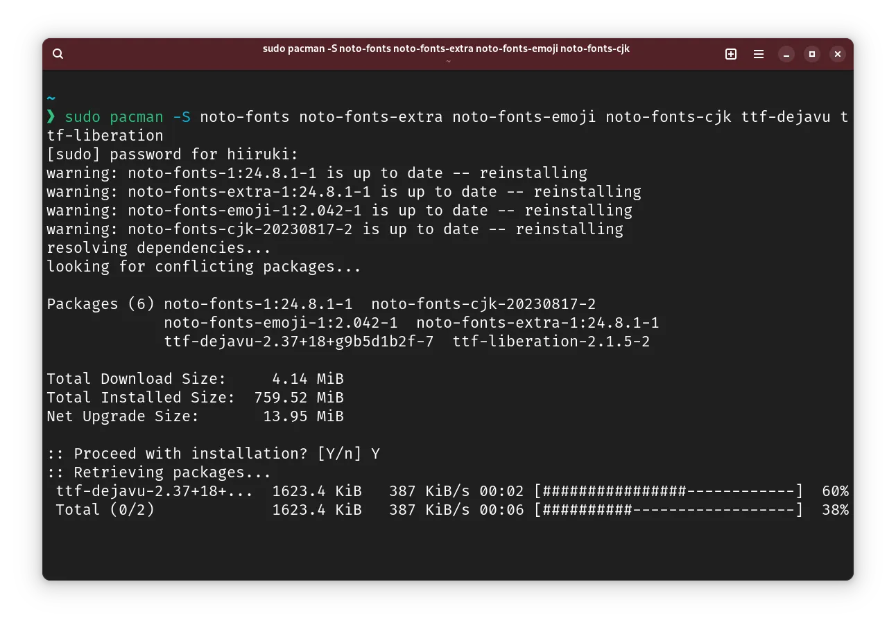
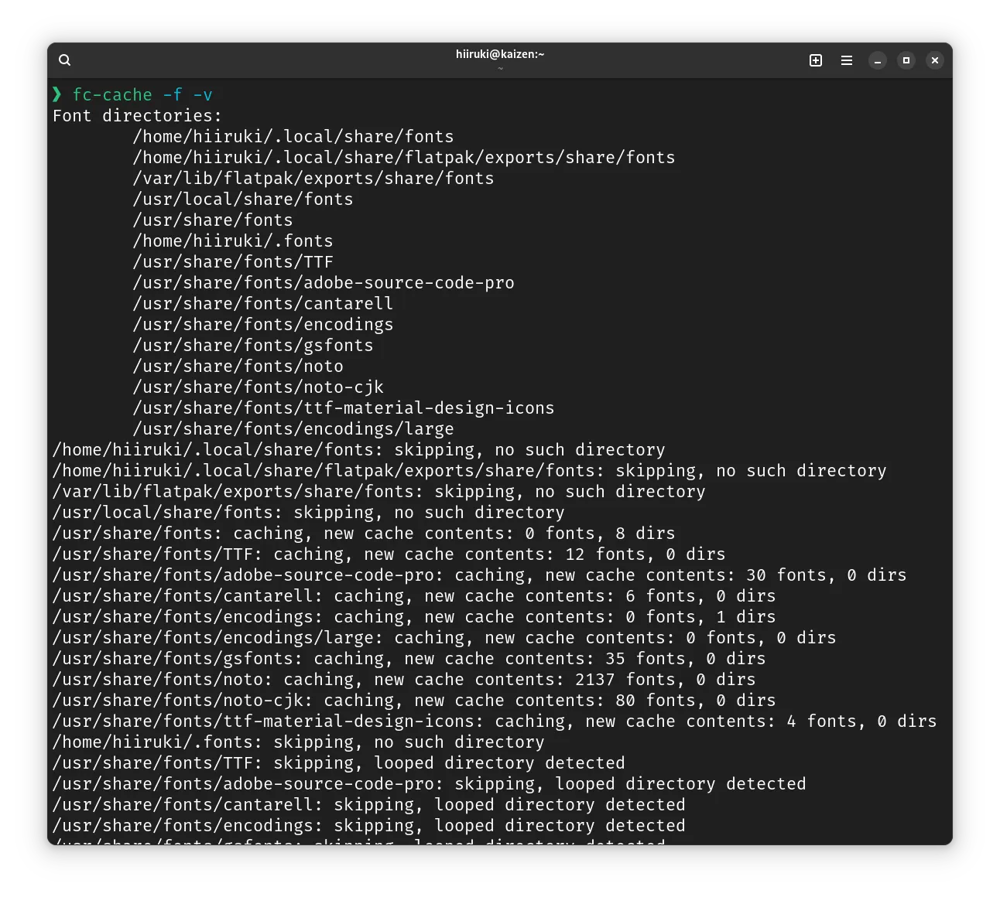
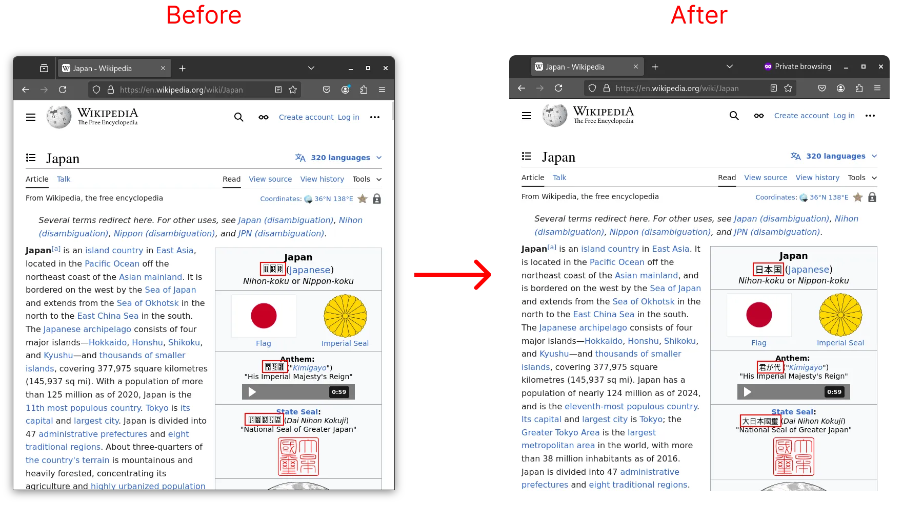
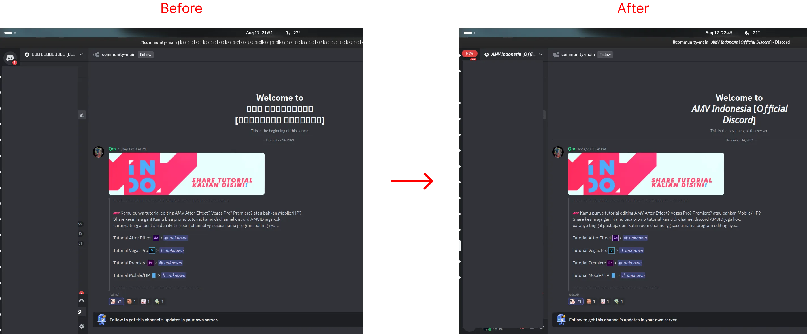

## Intro

When I use Arch Linux, I have a problem with font rendering in Firefox and other applications. The font is shown as boxes. This is because the font is not installed or not configured correctly. In this article, I will show you how to fix this problem.

## Steps

### 1. Install Required Fonts

```bash typed
$ sudo pacman -S noto-fonts noto-fonts-extra noto-fonts-emoji noto-fonts-cjk ttf-dejavu ttf-liberation
```



:::note
Although `noto-fonts` is installed by default in Arch Linux, it may not be installed in some cases. So, you should install it manually. And `noto-fonts-extra`, `noto-fonts-emoji`, and `noto-fonts-cjk` are also needed to display some special characters. (Tho it's actually included as a dependency of [`noto-fonts`](https://archlinux.org/packages/extra/any/noto-fonts/)). `ttf-dejavu` and `ttf-liberation` are also needed to display some characters.
:::

### 2. Refresh font cache

Pacman has already done this for you, but you can do it manually if you want.

```bash typed
$ fc-cache -f -v
```



This command will refresh the font cache. `-f` is to force the regeneration of the cache. `-v` is to show the progress.

### 3. Restart Firefox or other applications

After you have done the above steps, you should restart Firefox or other applications to see the changes.

### 4. (Optional) Change font settings in Firefox

If you still have problems with font rendering in Firefox, you can change the font settings in Firefox.

#### 1. Open Firefox

#### 2. Go to Settings

#### 3. Search for `fonts` or just scroll down to the `Fonts` section

   

   You can use the Default (DejaVu) or use the Noto fonts.

#### 4. Advanced settings

Make sure you check the `Allow pages to choose their own fonts, instead of your selections above` option to let the websites use their own fonts.

   

## Summary

Now you have fixed the font rendering problem in Firefox and other applications on Arch Linux. Here are some before and after screenshots.

### Firefox



### Discord



I hope this article helps you fix the font rendering problem on Arch Linux. You can also test the font rendering on this website:

- [unicode.org emoji-test.txt](https://www.unicode.org/Public/emoji/latest/emoji-test.txt)
- [Unicode 3.2 Test Page from cogsci.ed.ac.uk](https://www.cogsci.ed.ac.uk/~richard/unicode-sample-3-2.html)

## References

- [Fonts @ ArchWiki](https://wiki.archlinux.org/title/Fonts#Families)
- [[SOLVED] Some programs don't show some fonts @ Arch Linux Forum](https://bbs.archlinux.org/viewtopic.php?id=262837)
- [Firefox 57 : fonts not displayed @ Arch Linux Forum](https://bbs.archlinux.org/viewtopic.php?id=232010)
- [Some fonts not displaying correctly @ Firefox Support Forum](https://support.mozilla.org/en-US/questions/1274808)
- [Weird boxes showing instead of text in Arch Linux @ Reddit](https://www.reddit.com/r/archlinux/comments/slgacn/weird_boxes_showing_instead_of_text_in_arch_linux/)
- [Font configuration @ ArchWiki](https://wiki.archlinux.org/title/Font_configuration)
- [An open source font system for everyone @ Google Blog](https://developers.googleblog.com/en/an-open-source-font-system-for-everyone/)
- [Noto: A typeface for the world @ Google Noto Fonts](https://fonts.google.com/noto)
