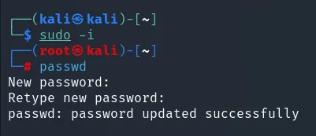
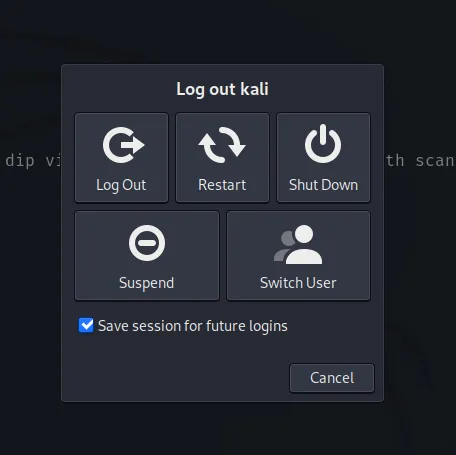
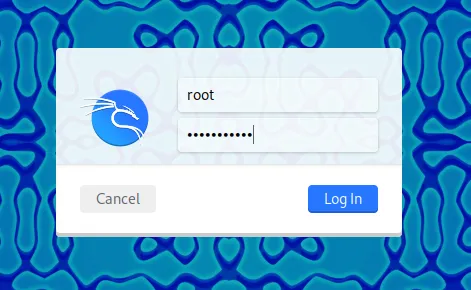
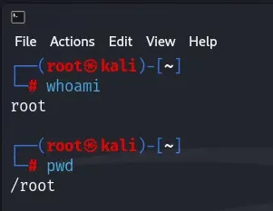
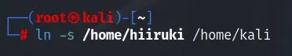
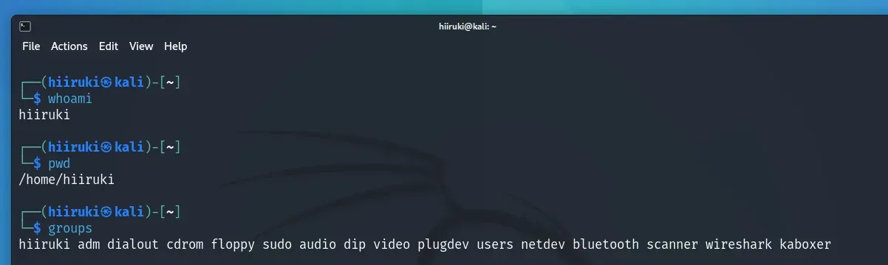
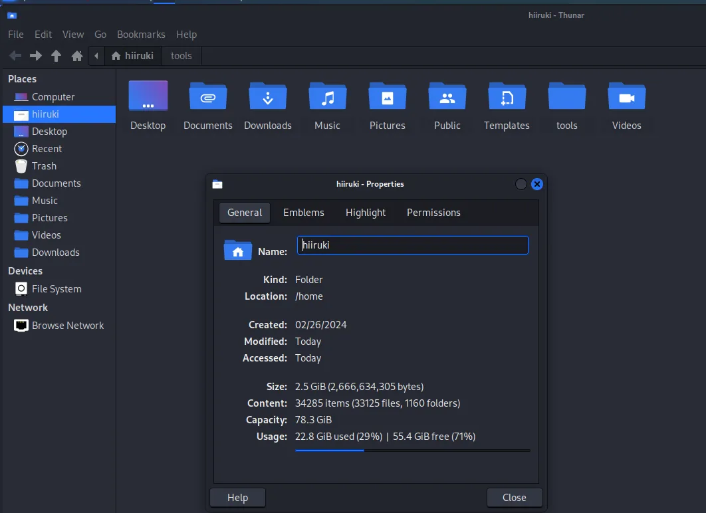
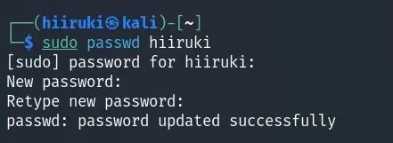

## Intro

I was using the [Kali Linux](https://www.kali.org/) virtual machine edition, specifically the [pre-built version](https://www.kali.org/get-kali/#kali-virtual-machines) for [VMware](https://blogs.vmware.com/workstation/2024/05/vmware-workstation-pro-now-available-free-for-personal-use.html) and [VirtualBox](https://www.virtualbox.org/). In this version, the default username is "kali" since it’s pre-configured, and we don't get to choose the username during installation. I found the default "kali" username a bit boring, so I wanted to change it to something I preferred. If you feel the same way, this guide is for you. Let's get started!

## Steps

### 1. Change to the root user

```bash typed
$ sudo -i
```

after that we can change the root password by typing:

```bash typed
$ passwd
```

type your new root password and confirm it.



### 2. Logout and switch to root user or restart

You can choose Log out, Switch user, or restart. I choose to restart because it's faster and it's a virtual machine. For server or production environment, you can choose to log out or switch user.



Use the root credentials that we already set in step 1.



### 3. Change the username as well as the home directory and the group

Make sure you are logged in as root user.



Then change the username using the following command:

```bash typed
$ sudo usermod -l new_username -d /home/new_username -m old_username
```
Example:


Explanation:

- `-l` is to change the login name
- `-d` is to change the home directory
- `-m` is to move the content of the old home directory to the new home directory

Change the group name using the following command:

```bash typed
$ groupmod -n new_username old_username
```

Example:


Explanation:

- `-n` is to change the name of the group

Create symbolic link for the old home directory to the new home directory

:::note
We need to create a symbolic link for the old home directory to the new home directory. This is because some applications may still refer to the old home directory. By creating a symbolic link, we can ensure that the applications can still access the old home directory.
:::

Type the following command:

```bash typed
$ ln -s /home/new_username /home/old_username
```

Example:



Explanation:

- `-s` is to create a symbolic link

(Optional) Change the user finger information (user database information). In this case I just want to change the full name.

```bash typed
$ chfn -f "New Full Name" new_username
```

Example:


Explanation:

- `-f` is to change the full name

### 4. Logout and switch to the new username or restart

Input your new username and the old password, which is `kali` in my case.


:::note
We use the old password because we haven't changed the password yet. We will change the password in the next step.
:::

Check the home directory and the group name. Make sure they are correct.



My data is still there as expected.



Then change the password for the new username.

```bash typed
$ sudo passwd new_username
```

Type your new password and confirm it.



## Summary

Everything is done. You have successfully changed the username as well as the home directory and the group. You have also created a symbolic link for the old home directory to the new home directory. You have also changed the user finger information and the password. Congratulations!

## References

- [3.4.4. Modifying User Settings @ Red Hat Docs](https://docs.redhat.com/en/documentation/red_hat_enterprise_linux/6/html/deployment_guide/cl-tools-usermod#cl-tools-usermod)
- [How to change Username and Password in Kali Linux | [Easiest method using terminal] | Cyber Kaify @YouTube](https://www.youtube.com/watch?v=lMLn4-Ife6A)
