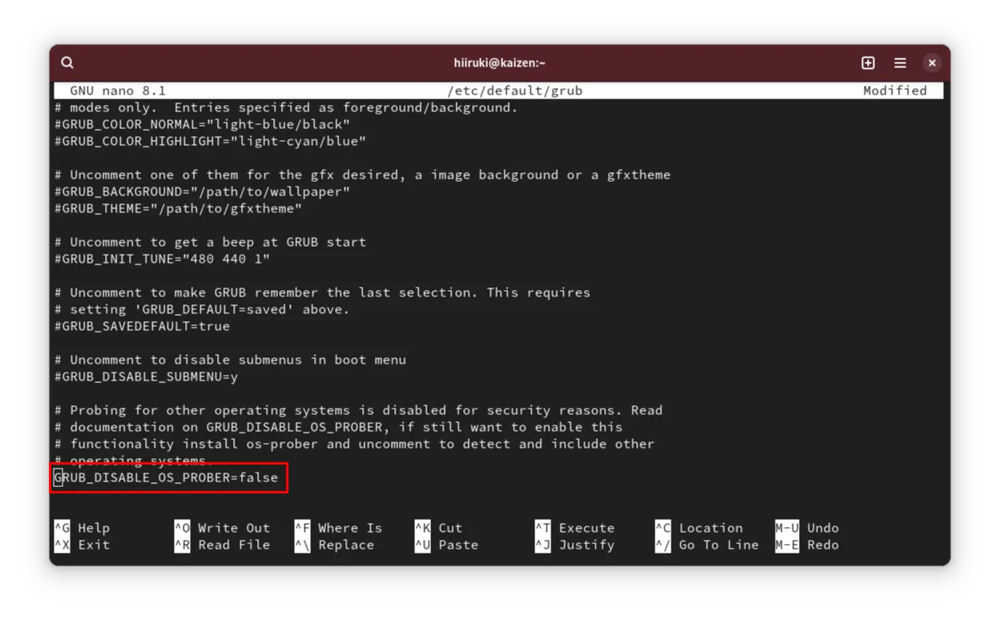
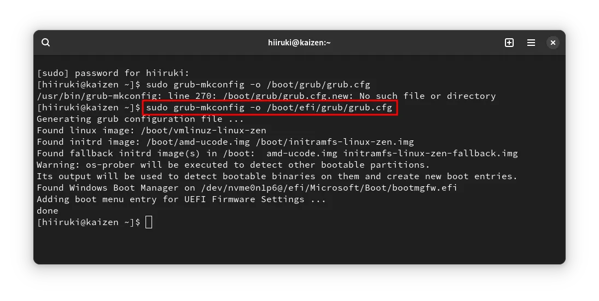
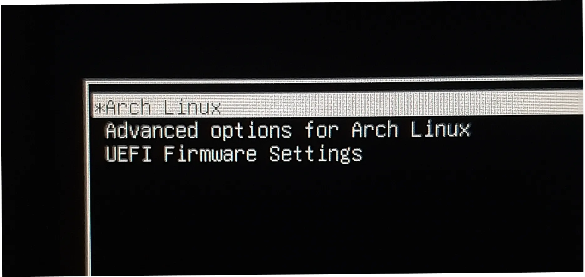
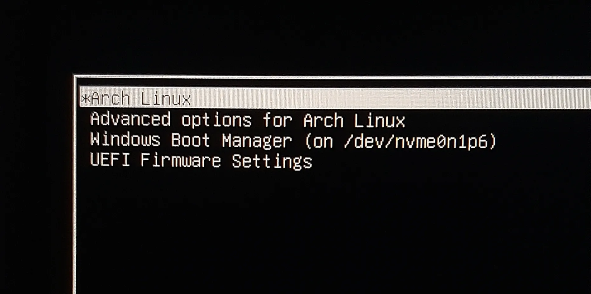

## Intro

This guide is for fixing the missing Windows boot option in the GRUB menu on a dual-boot system with Linux and Windows. So recently I installed Arch Linux on my laptop alongside Windows 11. After the installation, I noticed that the Windows boot option was missing in the GRUB menu.

## Steps

### 1. Install dependencies

```bash typed
$ sudo pacman -S os-prober ntfs-3g
```

- `os-prober` is a tool that detects other operating systems installed on the system.
- `ntfs-3g` is a driver that allows read-write access to NTFS partitions.

:::note
I'm using Arch Linux, so I'm using `pacman` to install the packages. If you're using a different Linux distribution, you can use the package manager of your distribution to install the packages.
:::

### 2. Configure GRUB

```bash typed
$ sudo nano /etc/default/grub
```

### 3. Uncomment the following line

Uncomment the following line in the `/etc/default/grub` file. Or simply remove the `#` at the beginning of the line.

```bash title="grub"
GRUB_DISABLE_OS_PROBER=false
```

- `GRUB_DISABLE_OS_PROBER=false` enables the detection of other operating systems installed on the system.



After making the changes, save the file using `Ctrl + X`, then press `Y` to confirm the changes, and press `Enter` to save the file.

### 4. Apply changes to GRUB using `grub-mkconfig`

```bash typed
$ sudo grub-mkconfig -o /boot/grub/grub.cfg
```

- `grub-mkconfig` will regenerate the GRUB configuration file based on the changes made to the `/etc/default/grub` or `/etc/grub.d/` files.
- `-o /boot/grub/grub.cfg` specifies the output file for the generated configuration.

:::note
The path `/boot/grub/grub.cfg` is the default location for the GRUB configuration file on Arch Linux. The path may vary depending your first installation/setup. Like in my case, my path is `/boot/efi/grub/grub.cfg` because when I installed Arch Linux, I used the `/boot/efi` partition as the EFI System Partition (ESP).
:::



### 5. Reboot

```bash typed
$ sudo reboot
```

#### Before



#### After



## Summary

So, we fixed the missing Windows boot option in the GRUB menu on a dual-boot system with Linux and Windows. We installed the `os-prober` and `ntfs-3g` packages, uncomment the `GRUB_DISABLE_OS_PROBER=false` line in the `/etc/default/grub` file, and regenerated the GRUB configuration file using `grub-mkconfig`.

## References

- [Arch Wiki - GRUB](https://wiki.archlinux.org/title/GRUB)
- [Detect Windows 11/10 in Grub on Arch Linux 2023 by A I + + @YouTube](https://www.youtube.com/watch?v=xBPn0fF8bTY)
