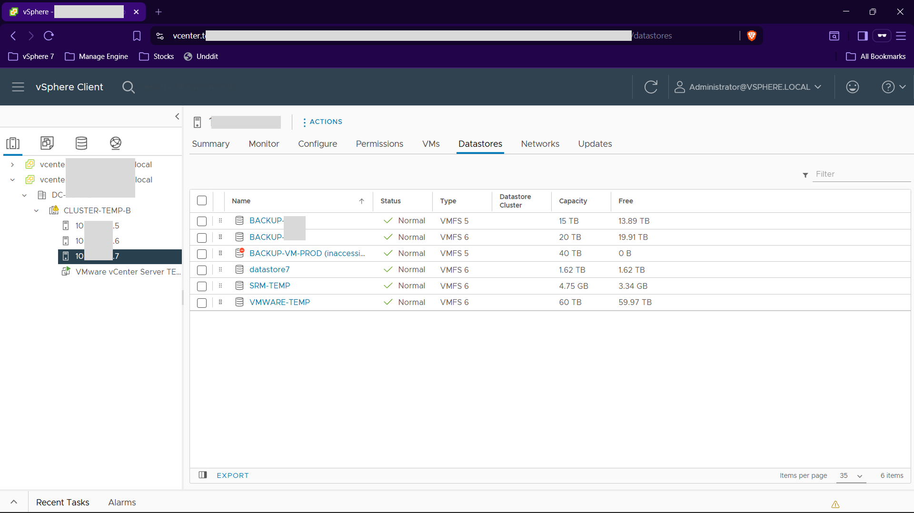
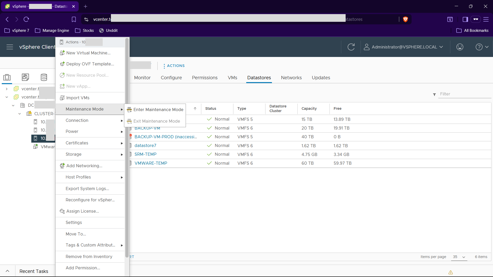
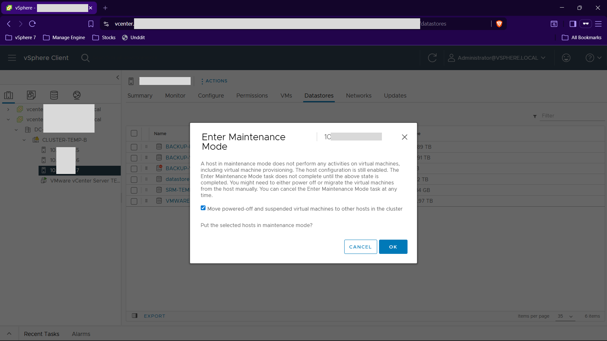
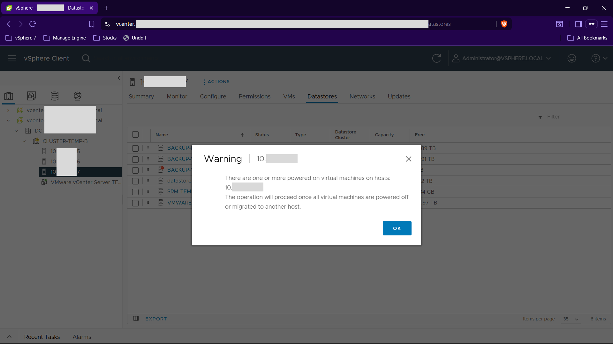
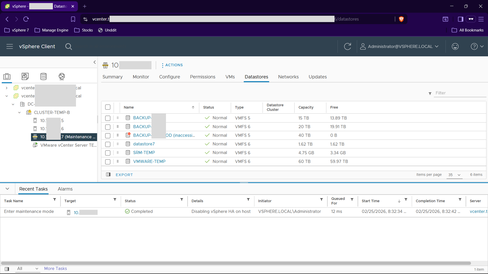
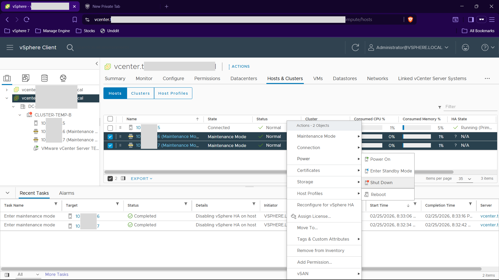
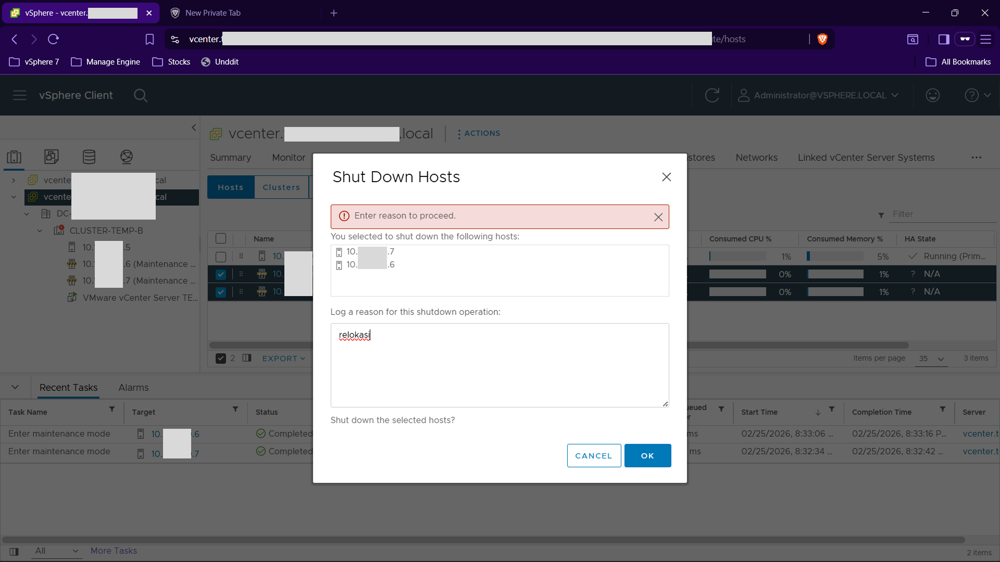
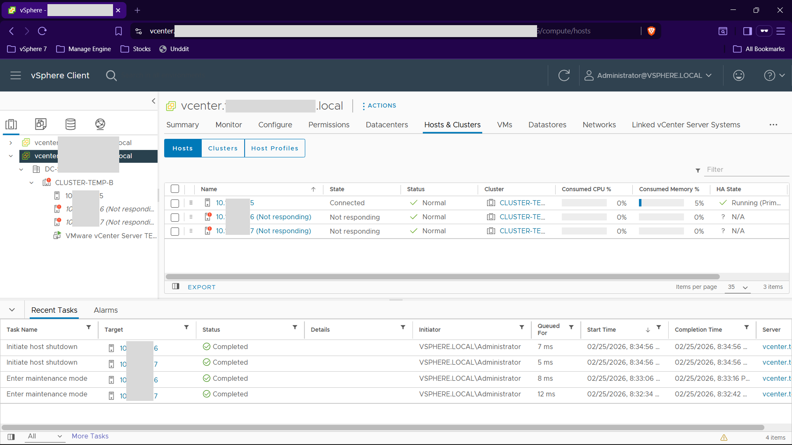

## Intro

This is a simple guide on how to shutdown Lenovo System x3850 X6 Server properly. Especially when you are already have a lot of VMs running on it. So you can safely shutdown the server without losing any data. In my case, I'm using VMware ESXi as the hypervisor and vCenter to manage it.

:::note
The server can be turned off in any of the following ways:
- You can turn off the server from the operating system, if your operating system supports this feature. After an orderly shutdown of the operating system, the server will turn off automatically.
- You can press the power-on button to start an orderly shutdown of the operating system and turn off the server, if your operating system supports this feature.
- If the operating system stops functioning, you can press and hold the power-on button for more than 4 seconds to turn off the server.
- The integrated management module (IMM) can turn off the server as an automatic response to a critical system failure.
- You can shutdown the server from VMware vCenter.
:::

## Steps

1. Login to the vCenter
2. Select the ESXi host you want to shutdown

:::tip
Before entering maintenance mode, make sure that all the VMs are migrated to another ESXi host. Although it will automatically migrate the VMs to another ESXi host when you enter maintenance mode when there is another ESXi host available.
:::

3. Right click on the ESXi host and select "Maintenance Mode" -> "Enter Maintenance Mode"

4. When prompted, you can check the "Migrate powered-off and suspended virtual machines to other hosts in the cluster" checkbox to automatically migrate the VMs to another ESXi host. Then click "OK"

Click OK again on the warning prompt.

5. Wait for the ESXi host to enter maintenance mode, the host will have a maintenance mode icon on it. Also in the log (Recent Tasks) you can see the status is completed.

6. Right click on the host you just put in maintenance mode, then select "Power" -> "Shut Down"

7. When prompted enter the reason for shutting down the host/server, then click "OK"

8. Wait for the host to shutdown. When the host is off, you can see the task "Initiate host shutdown" is completed. Also the host will have a red exclamation mark on it and the status will be "Not Responding"

The server LED will also blinking as the power is off. You can see it from the front of the server.

## References

- [Turning off the server @ Lenovo X6 Documentation](https://pubs.lenovo.com/x3850-x6-6241/nn1em_r_ugch1turnoffserver)
- [System x3850 X6 and x3950 X6 Installation and Service Guide](https://pubs.lenovo.com/x3850-x6-6241/PDF_3850x6_isg.pdf)
