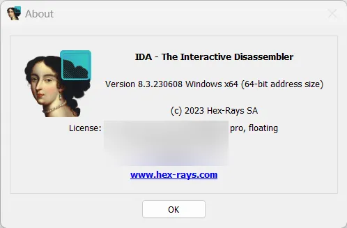
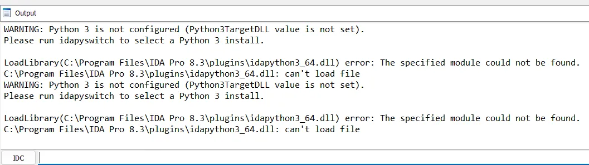
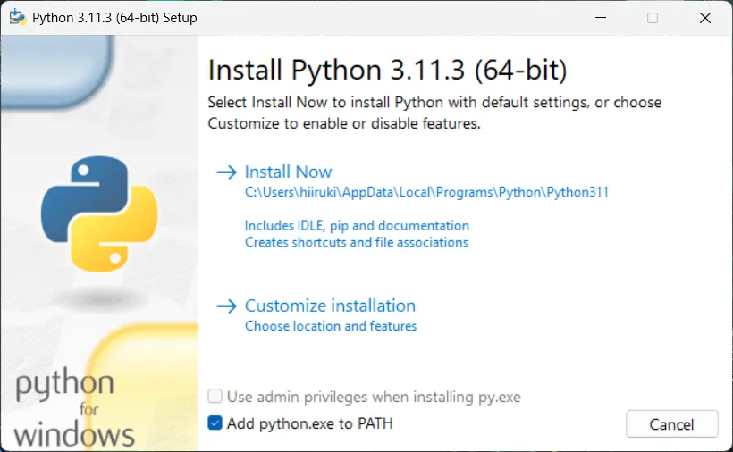
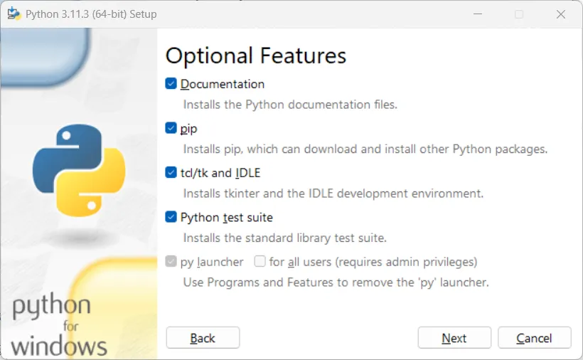
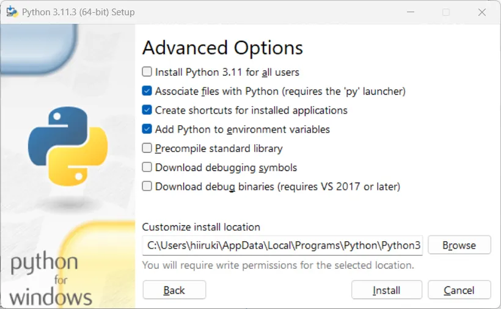
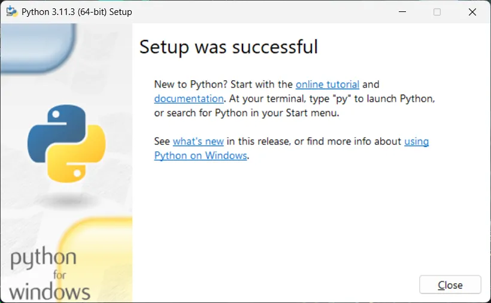
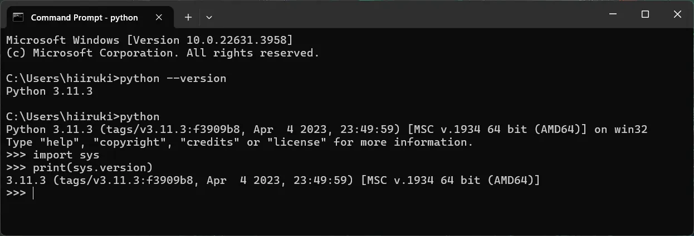
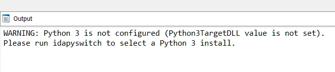
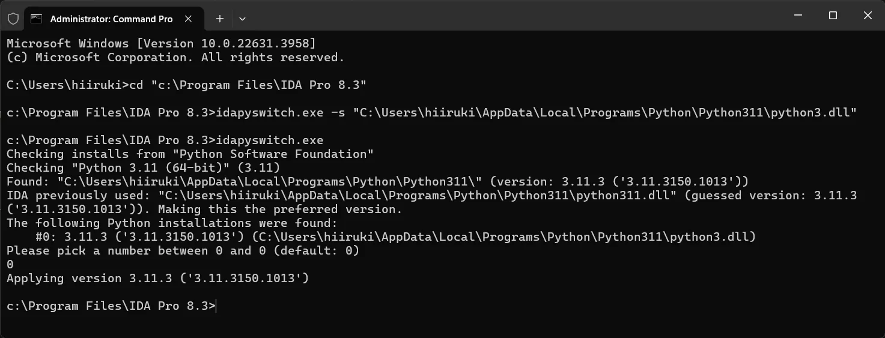
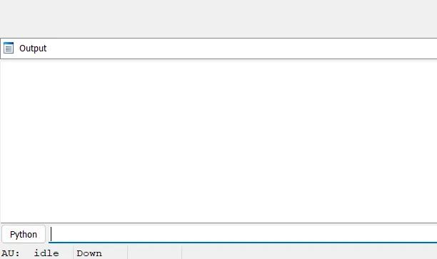

## Intro

[IDA Pro](https://hex-rays.com/ida-pro/) is a disassembler and debugger that is used to reverse engineer software. It is a powerful tool that can be used to analyze binary files and understand how they work. IDA Pro has a Python scripting interface that allows users to write scripts to automate tasks and extend the functionality of the software.



However, there is an issue with IDA Pro v8.3 when we start the program, it shows an error message in the output window `idapython3_64.dll: can't load file`. This error occurs because IDA Pro v8.3 is looking for the `idapython3_64.dll` file in the wrong location. Although the file is present in the plugins directory, IDA Pro v8.3 is not able to find it. This error also causes another error message `Python3TargetDLL` in the output window.



## Steps

1. Install Python 3.11.3 (64-bit) from the [official website](https://www.python.org/downloads/release/python-3113/).

    :::note
    Why Python 3.11.3? I found that IDA Pro v8.3 is compatible with Python 3.11.3. You can try other versions of Python 3.x, but I recommend using Python 3.11.3. Python 3.12 is working fine with IDA Pro v8.3, but the error still occurs. Idk why this happens.
    :::

    My Python installation settings:

    
    
    
    

    Then check the Python installation:

    

2. Fix the default Python for IDA Pro v8.3

    We fixed the `idapython3_64.dll` but the `Python3TargetDLL` error still occurs.

    

    To fix this, we need to set the default Python for IDA Pro v8.3. To do this we use the built-in `idapyswitch.exe` utility that comes with IDA Pro.

    - Open the command prompt as an administrator.
    - Navigate to the IDA Pro installation directory. For example, `cd "c:\Program Files\IDA Pro 8.3"`.
    - Locate `python3.dll` in the Python installation directory. For example, `C:\Users\hiiruki\AppData\Local\Programs\Python\Python311\python3.dll`.
    - Run the following command to set the default Python for IDA Pro v8.3:

        ```cmd typed prompt="c:\Program Files\IDA Pro 8.3>"
        c:\Program Files\IDA Pro 8.3> idapyswitch.exe -s "C:\Users\hiiruki\AppData\Local\Programs\Python\Python311\python3.dll""
        ```

    - Check the settings by running the `idapyswitch.exe`

    

3. Restart IDA Pro v8.3

    After setting the default Python for IDA Pro v8.3, restart the program. The error message `Python3TargetDLL` should no longer appear in the output window.

    

    Now you can use IDA Pro v8.3 without any issues.

---

> “Who’s cleverer, you or him?”<br>
> “Well… if the malware author uses all of his obfuscation techniques, he might give me a little trouble.”<br>
> “But would you lose?”


## References

- [IDA报错Python 3 is not configured (Python3TargetDLL value is not set)](https://blog.csdn.net/xuelang532777032/article/details/130724986)
- [[原创]ida7使用python问题](https://bbs.kanxue.com/thread-279989.htm)
- ["Software\Hex-Rays\IDA" exists, but no "Python3TargetDLL" value found No Python installations were found](https://www.cnblogs.com/DirWang/p/15095761.html)
- [Fix Ida Pro 7.5 - IdaPython3.dll can't load file Error](https://guidedhacking.com/threads/fix-ida-pro-7-5-idapython3-dll-cant-load-file-error.19513/)
- [IDA and common Python issues](https://hex-rays.com/blog/ida-and-common-python-issues/)