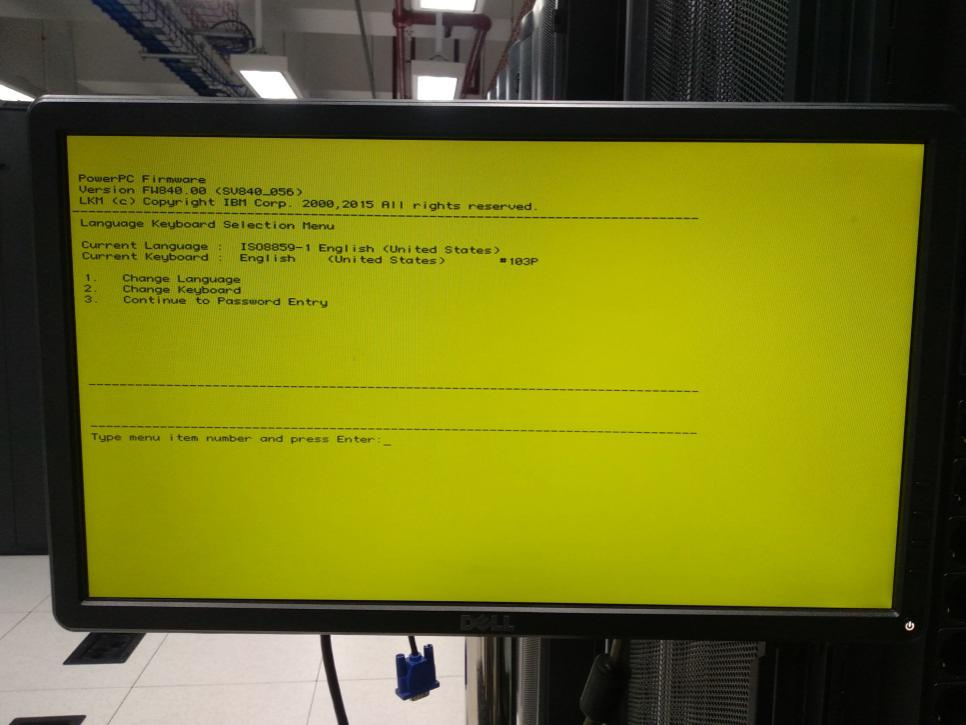
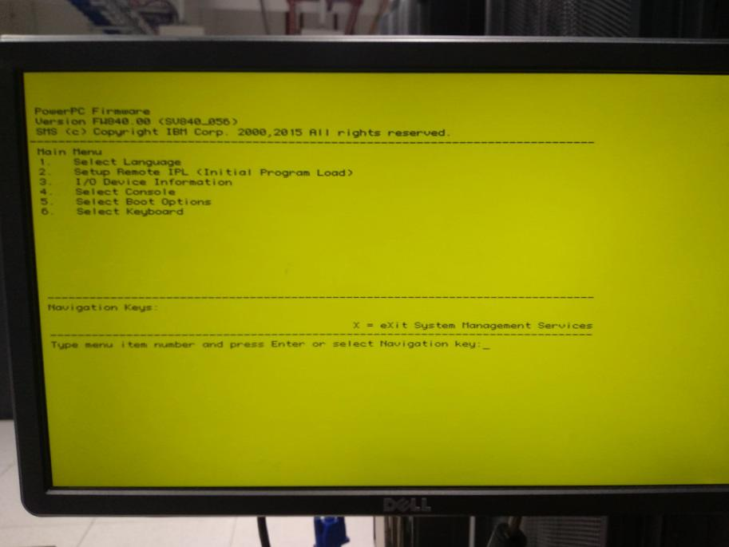
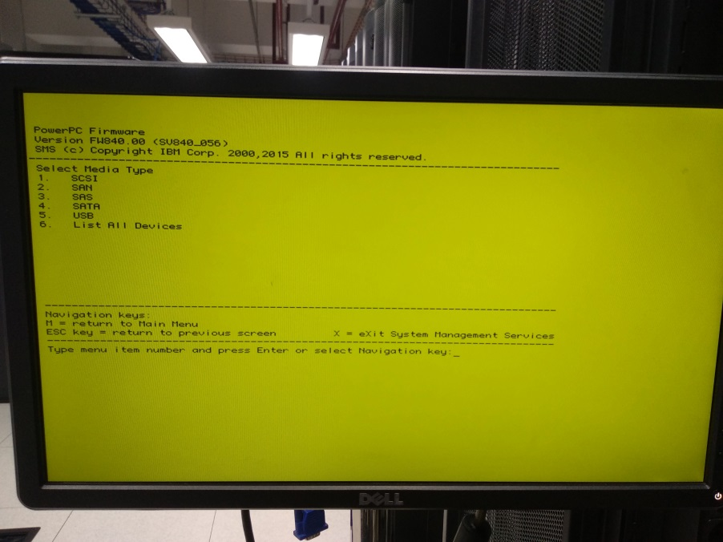
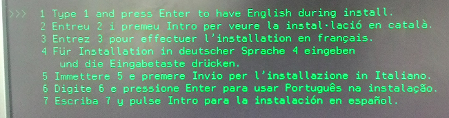
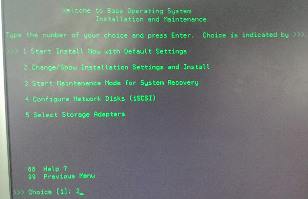
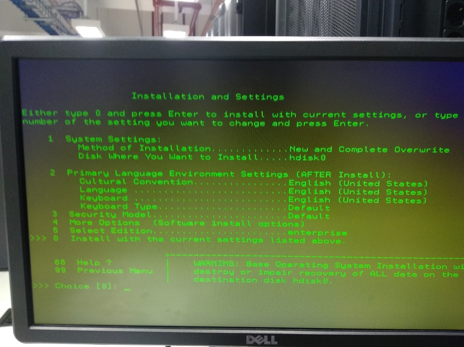
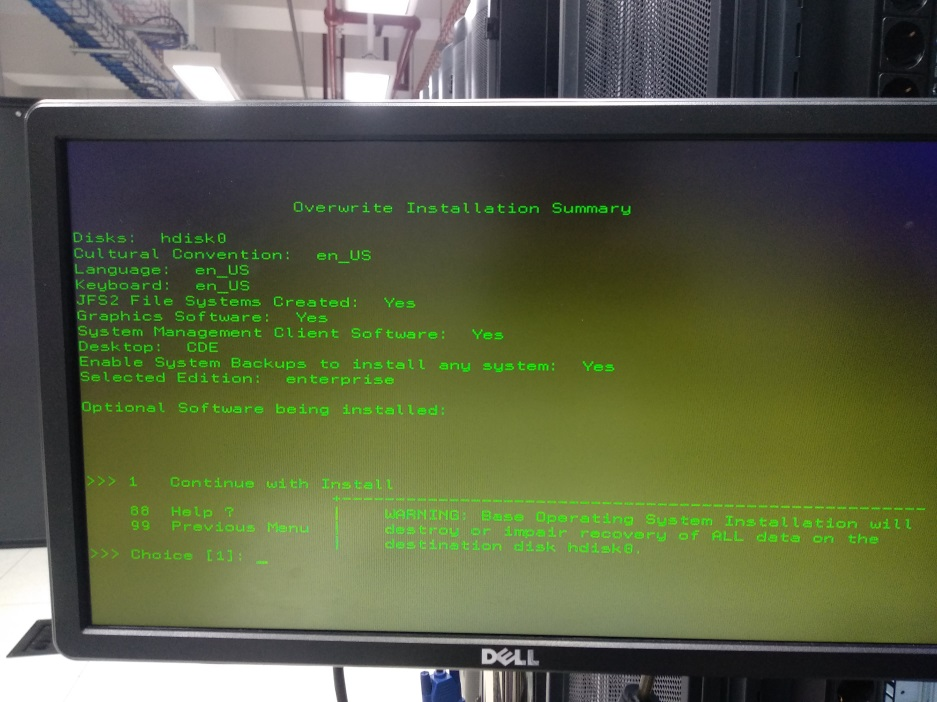
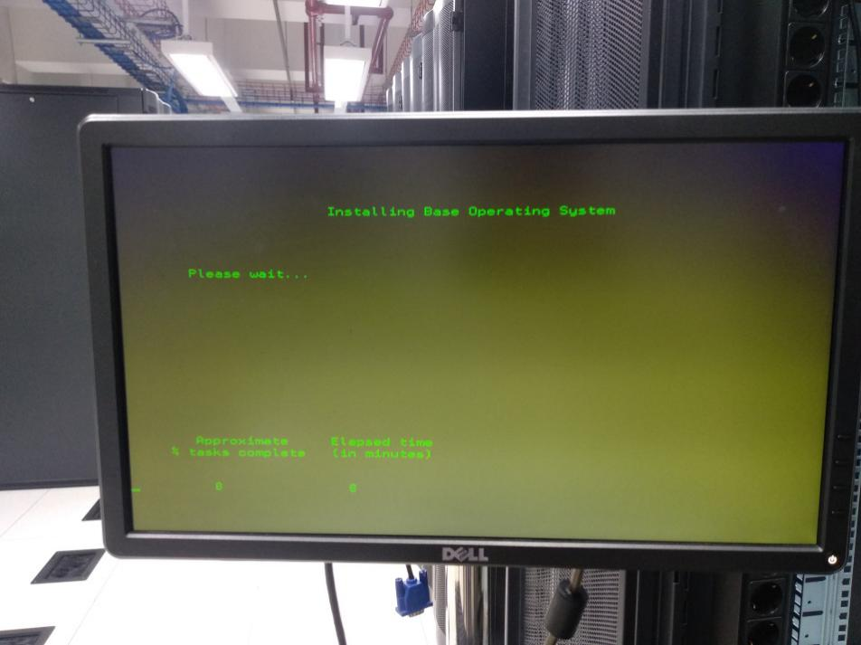

## Intro

[AIX](https://en.wikipedia.org/wiki/IBM_AIX "IBM AIX @ Wikipedia") is a Unix operating system developed by IBM for its Power Systems hardware. It is a proprietary operating system that is used in enterprise environments for high-availability and mission-critical applications.

In my company, we use AIX OS as the base operating system for our production servers running [IBM Db2](https://en.wikipedia.org/wiki/IBM_Db2 "IBM DB2 @ Wikipedia"). Database workloads are separated from application and hypervisor layers, which improves both security and performance.

The latest hardware we use is IBM [Power S924](https://www.ibm.com/docs/en/power9/9009-42A "IBM Power S924 @ IBM") a.k.a [Power9](https://en.wikipedia.org/wiki/POWER9 "POWER9 @ Wikipedia") server.

It is a very stable operating system and we have never had any issues with it.

## Steps

1. Insert AIX CD/DVD
2. Press <kbd>1</kbd> to select the next step to ***“SMS Menu”***

	

3. Press <kbd>3</kbd> to select the next step to ***“Continue to Password Entry”***

	
	
4. Type the default password **“admin”**

	
	
5. Press <kbd>5</kbd> to continue to ***“Select Boot Options”***

	

6. Press <kbd>1</kbd> to continue to ***“Select Install/Boot Device”***

	

7. Since this guide uses a CD/DVD device, press <kbd>2</kbd> to select ***“CD/DVD”***

	

8. Press <kbd>6</kbd> to select ***“List All Device”***

	

9. Select ***“SATA”*** because the device used is CD/DVD

	

10. Select **_“Normal Boot”_** and wait for the reboot process to complete

	

11. Press <kbd>1</kbd> and press <kbd>Enter</kbd>

	

12. Press <kbd>2</kbd> to continue to ***“Change/Show Installation Settings and Install”***, and press <kbd>Enter</kbd>

	

13. Change ***“Select Edition”*** to ***“Enterprise”***

	Press <kbd>5</kbd> then press <kbd>Enter</kbd> until it changes to ***“Enterprise”***
	If RAID, press <kbd>1</kbd> to set the use of hard disk for OS and installation type
	If not RAID, press <kbd>0</kbd> to install
	
	And make sure to press <kbd>4</kbd> to ensure the FTP/IP installation is **“yes”**

	

## References

- [IBM AIX @ IBM](https://www.ibm.com/products/aix "IBM AIX @ IBM")
- [IBM AIX @ Wikipedia](https://en.wikipedia.org/wiki/IBM_AIX "IBM AIX @ Wikipedia")
- [IBM Power S924 @ IBM](https://www.ibm.com/docs/en/power9/9009-42A "IBM Power S924 @ IBM")
- [POWER9 @ Wikipedia](https://en.wikipedia.org/wiki/POWER9 "POWER9 @ Wikipedia")
- [IBM Db2 @ Wikipedia](https://en.wikipedia.org/wiki/IBM_Db2 "IBM DB2 @ Wikipedia")
- [IBM Db2 @ IBM](https://www.ibm.com/products/db2-database "IBM Db2 @ IBM")