## Intro

[IBM Db2](https://en.wikipedia.org/wiki/IBM_Db2 "IBM Db2 @ Wikipedia") is a [relational database management system (RDBMS)](https://en.wikipedia.org/wiki/Relational_database "Relational Database @ Wikipedia") developed by [IBM](https://www.ibm.com/us-en "IBM @ Wikipedia"). It is a proprietary database software that is used in enterprise environments for high-availability and mission-critical applications such as Banking, Finance, and Government.

### Base Installation

1. Open the terminal and check the disk using `df -g`
2. Move to `/opt` directory using `cd /opt`
3. Create master directory using `mkdir master`
4. Move to master directory using `cd master`
5. Open WinSCP and login using IP Address, user, and password from server

    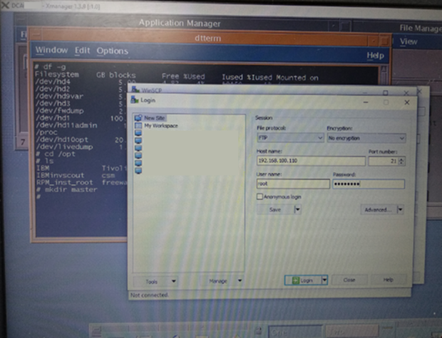

6. Copy file **“v10.5fp5_aix64_server_t.tar”** to `/opt/master` directory

    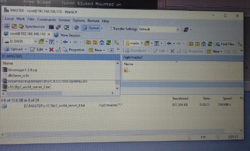

7. Back to terminal, check the file in master directory using `ls` command

8. Extract file **“v10.5fp5_aix64_server_t.tar”** in master directory using `tar -xvf v10.5fp5_aix64_server_t.tar` command

9. Back to terminal, check the file in master directory using `ls` command

10. Move to master directory using `cd server_t`

    Check the file in server_t directory using `ls -l` command

    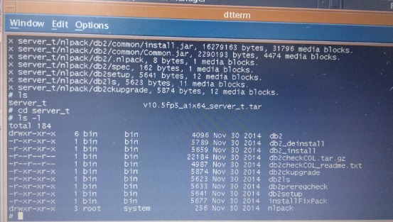

11. Run the command `./db2setup`

12. After running the command, the following display will appear:

    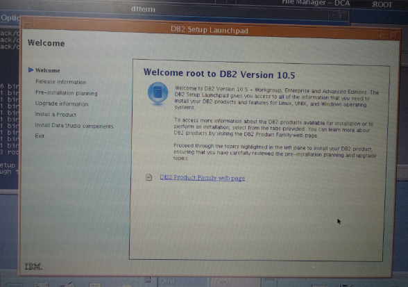

13. In install a Product, select ***“Install New”***

    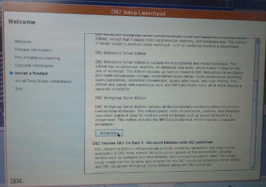

14. Click ***“Next”*** on the following display:

    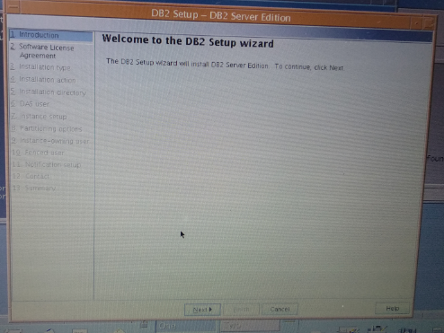

15. In Software License Agreement, select ***“I Accept the terms in the license aggrement”***, and click ***“Next”***

16. In Installation Type, select ***“Custom 1640-2730 MB”***, and click ***“Next”***

    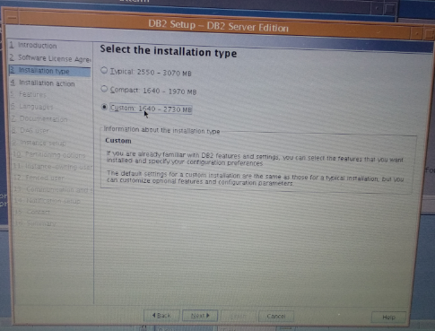

17. In Installation Action, select ***“Install DB2 Server Edition on this computer and save my settings in a response file”***, and click ***“Next”***

    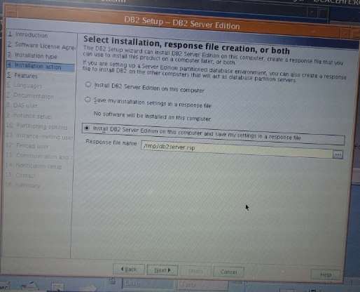

18. In Features, check all except ***“Oracle Data Source Support”***, and click ***“Next”***

    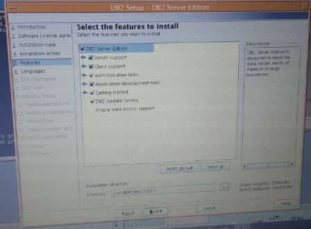

19. In Language, make sure to select **English** and click ***“Next”***

20. In Documentation, select ***“On the IBM Website”***, and click ***“Next”***

    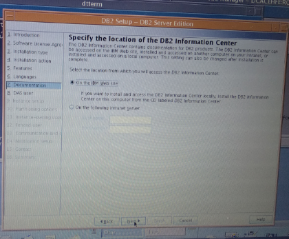

21. In DAS User, select ***“New User”*** and fill in the form as needed and click ***“Next”***

    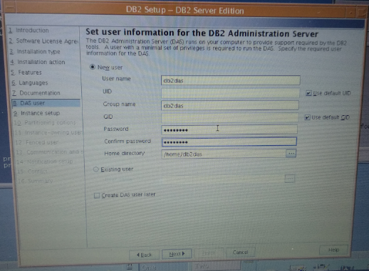

22. In Instance Setup, select ***“Create a DB2 Instance”***, and click ***“Next”***

    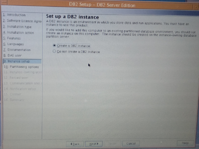

23. In Partitioning Options, select ***“Single Partition Instance”***, and click ***“Next”***

    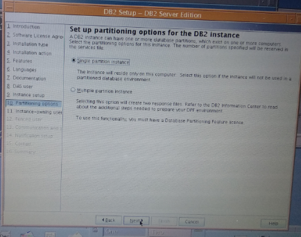

24. In Instance-Owning User, select ***“New User”*** and fill in the form as needed and click ***“Next”***

    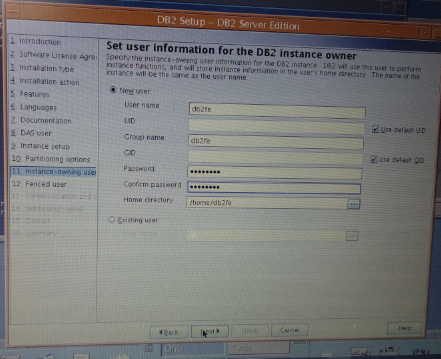

25. In Fenced User, select ***“New User”*** and fill in the form as needed and click ***“Next”***

    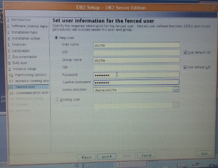

26. In Communication and Startup, select ***“Configure”*** and fill in the form as needed and click ***“Next”***

    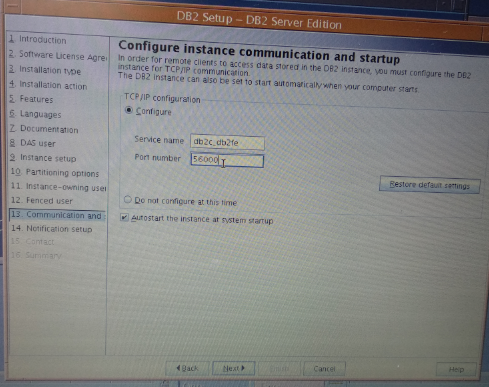

27. In Notification Setup, select ***“Do not set up your DB2 server to send notifications at this time”***, and click ***“Next”***

    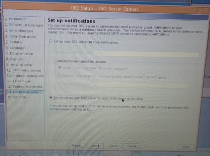

28. In Summary, click ***“Finish”*** and wait for the installation process to complete

    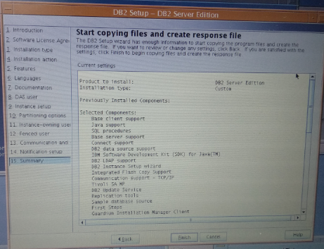

29. If the process is complete, make sure the status is **“Success”** and click ***“Finish”***

    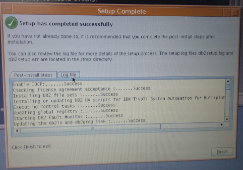

### Adding Instances

1. Next, to add instances on the database server, you can start by using the command `cd /opt/IBM/db2/v10.5/instance/`

    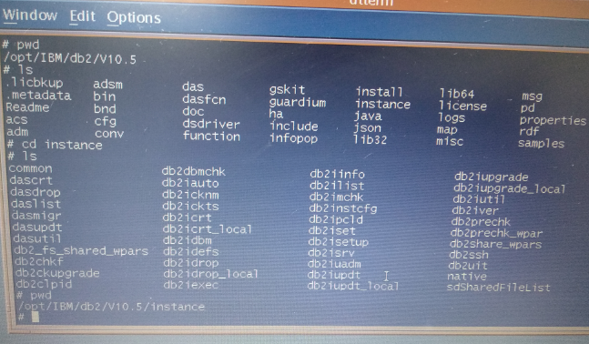

2. Run the command `./db2isetup`

3. In Installation Action, select ***“Perform instance setup and save my settings in a response file”***, and click ***“Next”***

    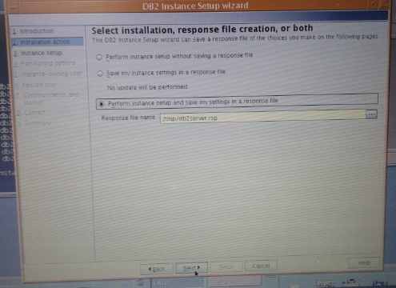

4. If the message “The file you have specified already exist. Do you want to overwrite it?” appears, click ***“Yes”*** and click ***“Next”***

    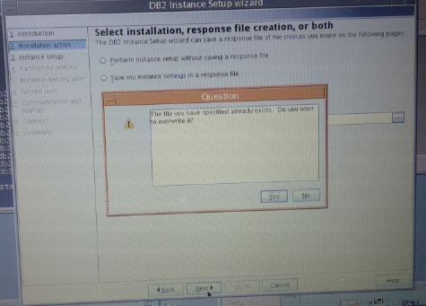

5. In Instance Setup, select ***“Create a DB2 instance”***, and click ***“Next”***

    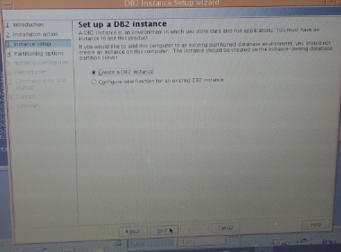

6. In Partitioning Options, select ***“Single Partition Instance”***, and click ***“Next”***

    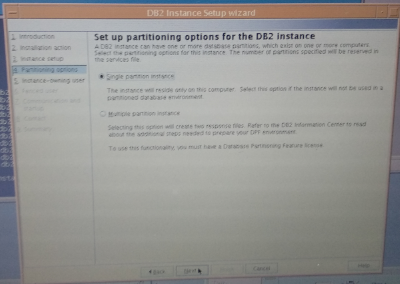

7. In Instance-Owning User, select ***“New User”*** and fill in the form as needed and click ***“Next”***

    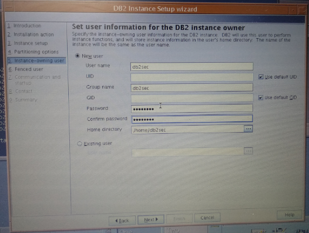

8. In Fenced User, select ***“New User”*** and fill in the form as needed and click ***“Next”***

    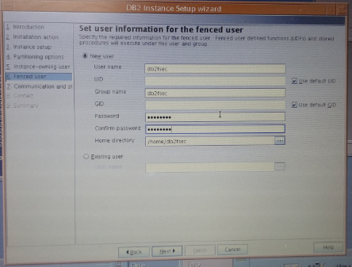

9. In Communication and Startup, select ***“Configure”*** and fill in the form as needed and click ***“Next”***

    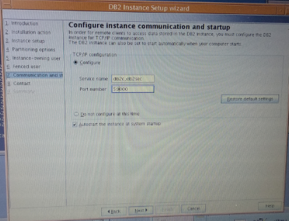

10. In Contact, select ***“Defer this task until after installations is complete”***, and click ***“Next”***

    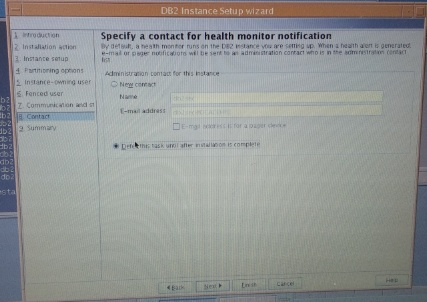

11. In Summary, click ***“Finish”*** and wait for the installation process to complete

    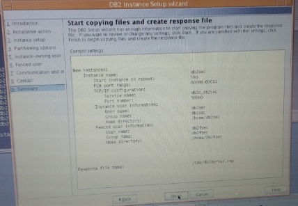

12. If the process is complete, make sure the status is **“Success”** and click ***“Finish”***

    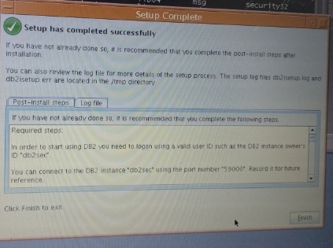

### Creating Volume Group

1. Run the command `smitty mkvg`

2. In Add an Original Volume Group, fill in the form as needed and click ***“OK”***

3. In VOLUME GROUP name, fill in the form as needed and click ***“OK”***

    In Physical partition SIZE in megabytes, fill in the form as needed and click ***“OK”***

    In PHYSICAL VOLUME names, fill in the form as needed and click ***“OK”***

    In Force the creation of a volume group, fill in the form as needed and click ***“OK”***

### Creating Logical Volume

1. Run the command `smitty mklv`

2. Press <kbd>F4</kbd> to select ***“Volume Group name”*** as needed, and press <kbd>Enter</kbd>

    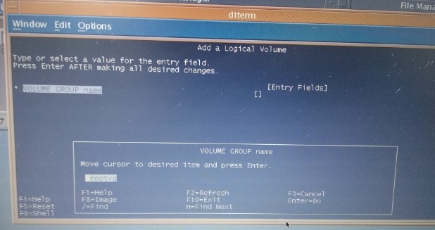

3. Fill in the form as needed and click ***“OK”***

4. Fill in ***“Logical Volume name”*** as needed<br>
    Fill in ***“Number of LOGICAL PARTITIONS”*** with “100” (fill in according to total hardisk)<br>
    Fill in ***“PHYSICAL VOLUME names”*** according to the available hdisk & that will be partitioned<br>
    Fill in ***“Logical volume TYPE”*** with **“jfs2”**

    :::note
    If using non raid controller<br>
    Fill in ***“MAXIMUM NUMBER of LOGICAL PARTITIONS”*** with **“1664”**<br>
    Fill in ***“Stripe Size”*** with **“64K”**
    :::

    Then press <kbd>Enter</kbd>

### Creating Mount Point

1. Run the command `smitty jfs2`

2. Select ***“Add an Enhanced Journaled File System on a Previously Defined Logical Volume”*** and press <kbd>Enter</kbd>

    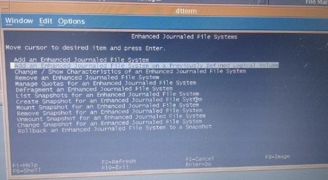

3. Select **“Logical Volume name”** as needed, and press <kbd>Enter</kbd>

    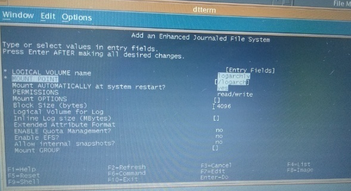

    Fill in ***“MOUNT POINT”*** as needed

    Change ***“Mount AUTOMATICALLY at system restart?”*** to ***“Yes”*** and press <kbd>Enter</kbd>

4. To display the mount that was created, run the command `mount (mount point name)`

    Example : `mount /audit`

5. Check if the mount that was created can appear by running the command `df -g`

6. Run the command `chmod –R 777 (mount point name)`

    Example : `chmod –R 777 /audit`

### Configuring Database Manager

1. Open putty using Server IP Address, and login according to the login user and login password that can be accessed

2. Check database manager configuration using the command `db2 get dbm cfg`

3. Change the value of the following parameters:

    - Change **“FEDERATED”** from ***“No”*** to ***“Yes”***
    - Change **“DFT_MON_BUFPOOL”** from ***“Off”*** to ***“On”***
    - Change **“DFT_MON_LOCK”** from ***“Off”*** to ***“On”***
    - Change **“DFT_MON_SORT”** from ***“Off”*** to ***“On”***
    - Change **“DFT_MON_STMT”** from ***“Off”*** to ***“On”***
    - Change **“DFT_MON_TABLE”** from ***“Off”*** to ***“On”***
    - Change **“DFT_MON_UOW”** from ***“Off”*** to ***“On”***
    - Change **“AUDIT_BUF_SZ”** from ***“1024”***

    Run the following commands:

    ```bash
    db2 update dbm cfg using FEDERATED YES
    db2 update dbm cfg using DFT_MON_BUFPOOL ON
    db2 update dbm cfg using DFT_MON_LOCK ON
    db2 update dbm cfg using DFT_MON_SORT ON
    db2 update dbm cfg using DFT_MON_STMT ON
    db2 update dbm cfg using DFT_MON_TABLE ON
    db2 update dbm cfg using DFT_MON_UOW ON
    db2 update dbm cfg using AUDIT_BUF_SZ 1024
    db2 update dbm cfg using DIAGSIZE 200
    db2 update dbm cfg using SYSCTRL_GROUP DB2CTRL
    db2 update dbm cfg using SYSMAINT_GROUP DB2MAINT
    db2 update dbm cfg using SYSMON_GROUP DB2MON
    db2 update dbm cfg using SRVCON_AUTH SERVER
    db2 update dbm cfg using DFTDBPATH /data
    db2 update dbm cfg using SVCENAME db2c_db2fe
    ```

    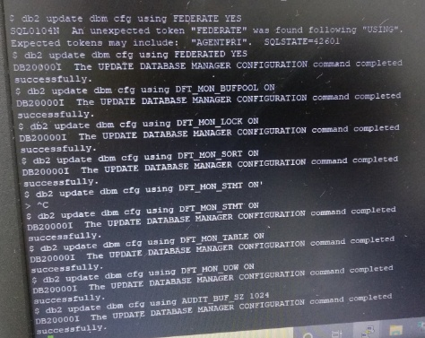

4. Run the command `db2stop` then run the command `db2start`


### License Setting

1. To see the DB2 license, run the command `db2licm –l`

2. Open WinSCP and login using the Server IP Address, user, and password that can be accessed

    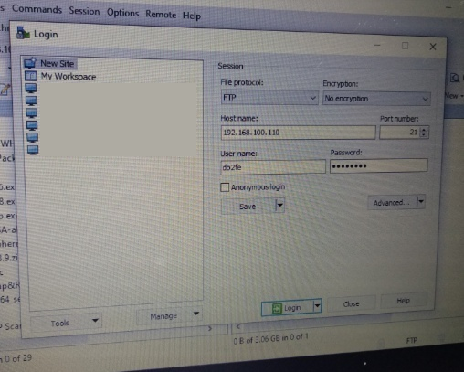

3. Copy the **“db2aese_u.lic”** file to the `/home/db2fe/sqllib/adm/db2aese_u.lic` folder

    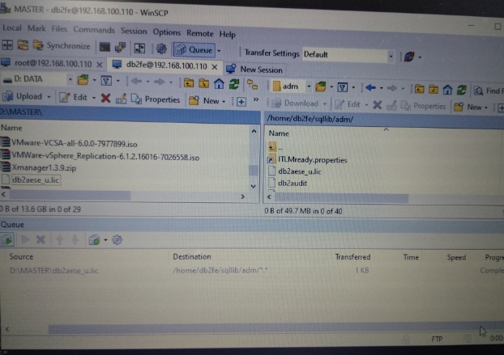

4. Open putty, go to the directory where the **db2aese_u.lic** file is stored

    Example: run the command `cd /home/db2fe/sqllib/adm`

5. Run the command

    ```bash
    db2licm -a /home/db2fe/sqllib/adm/db2aese_u.lic
    ```

    With this, the DB2 license expiry date which was previously still **"trial"** becomes **"permanent"**

6. Check the DB2 license again, run the command `db2licm –l`

7. Login to putty using the Host Name / IP Address and login using the root user

### Creating History Log

1. To create a history log, run the following command:

    ```bash
    cd /usr
    mkdirhistlog
    chmod –R 777 histlog
    vi /etc/profile
    ```

2. Add the following code at the bottom (after trap 1 2 3)

    ```bash
    HISTSIZE=10000
    HISTFILE=/usr/histlog/${LOGNAME}_$(date +%Y%m%d%H%M%S).$$
    export HISTSIZE HISTFILE
    ```

    :::note
    To insert text, press **"ESC"** then press **"i"**
    To delete text, press **"ESC"** then press **"x"**
    To save, press **"ESC"** then press **":wq!"**
    :::

## References

- [Db2 installation methods](https://www.ibm.com/docs/en/db2/11.5.x?topic=servers-db2-installation-methods)
- [IBM Db2 @ Wikipedia](https://en.wikipedia.org/wiki/IBM_Db2 "IBM DB2 @ Wikipedia")
- [IBM Db2 @ IBM](https://www.ibm.com/products/db2-database "IBM Db2 @ IBM")