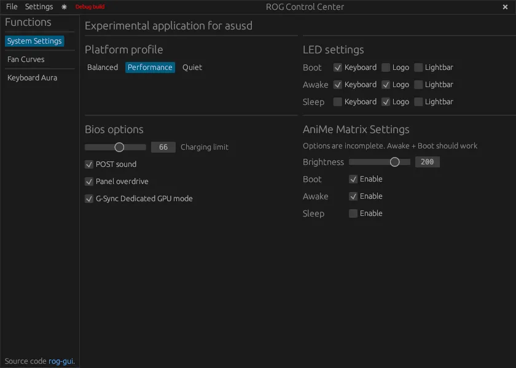
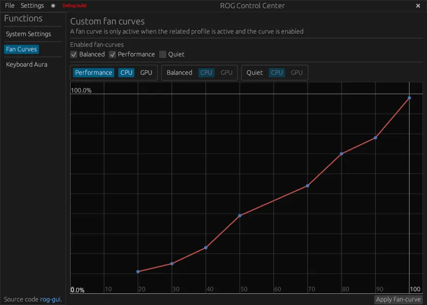
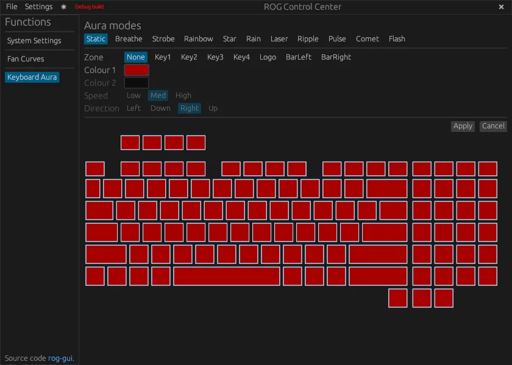
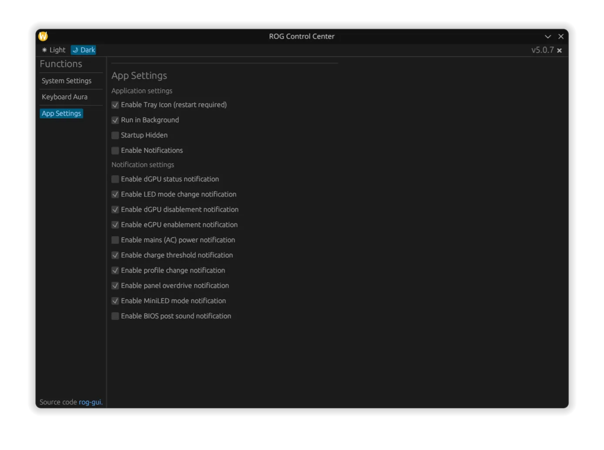
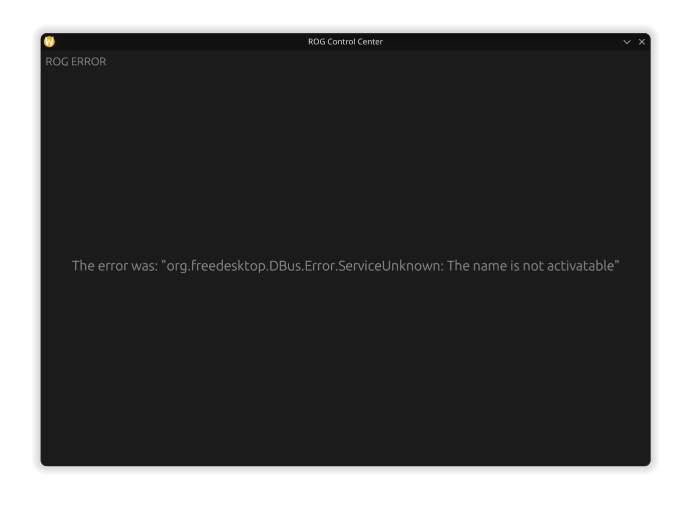
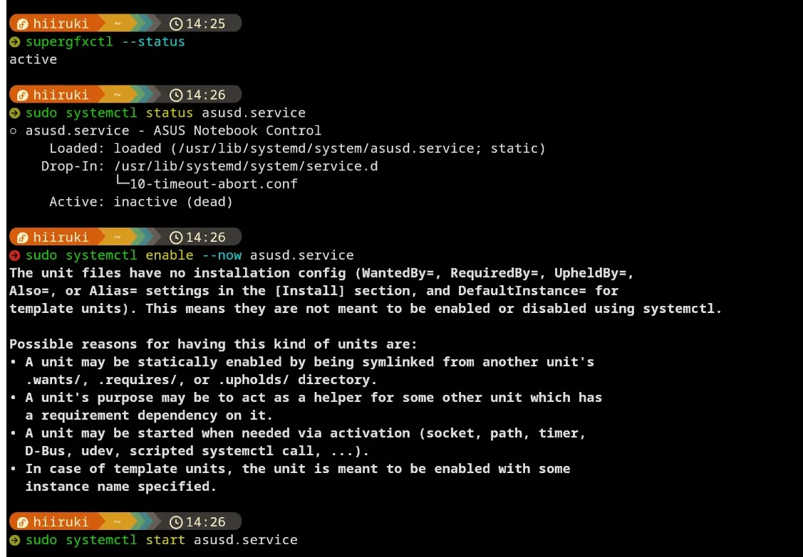
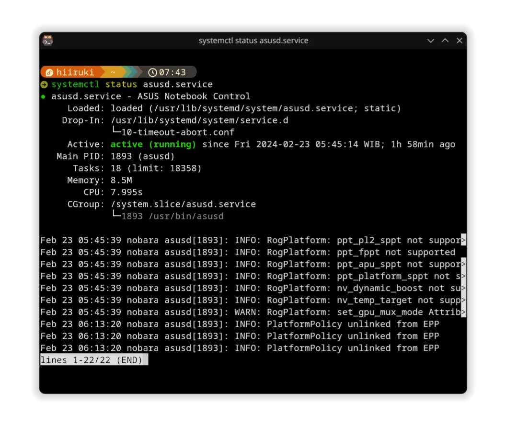

## Intro

The ROG Control Center is a software that allows users to control the performance of their ASUS ROG laptops. But, now is replaced by [Armoury Crate](https://rog.asus.com/us/armoury-crate/). It is only available for Windows, but there are some open-source projects that aim to bring the same functionality to Linux. One of these projects is [asusctl](https://gitlab.com/asus-linux/asusctl), which is a command-line tool to control the performance of ASUS laptops. This guide will show you how to install and setup asusctl on your Linux machine.

ROG Control Center is GUI version of asusctl, which use core system of `asusctl` and `supergfxctl`. At this time it is still a WIP, but it has almost all features in place already.

This software is designed to work with ASUS ROG/TUF laptops but may work with other ASUS laptops as well.

So, this guide will also show you how to install and setup ROG Control Center on your Fedora Linux machine.

### My Setup

- **Laptop**: [ASUS TUF Gaming A15 (FX506IH)](https://www.asus.com/laptops/for-gaming/tuf-gaming/asus-tuf-gaming-a15/)
- **OS**: [Nobara 39](https://nobaraproject.org/) (Fork of Fedora 39 Workstation with gaming oriented tweaks)
- **Kernel**: [6.7.5-200.fsync.fc39.x86_64](https://koji.fedoraproject.org/koji/buildinfo?buildID=2405078)
- **DE**: [KDE Plasma 5.27.10](https://kde.org/announcements/plasma/5/5.27.10/)

### Features

- System daemon
- GUI app (includes tray and notifications)
- Setting/modifying built-in LED modes
- Per-key LED setting
- Fancy LED modes (See examples) (currently being reworked)
- AniMatrix display on G14 and M16 models that include it
- Set battery charge limit (with kernel supporting this)
- Fan curve control on supported laptops (G14/G15, some TUF like FA507)
- Toggle bios setting for boot/POST sound
- Toggle GPU MUX (g-sync, or called MUX on 2022+ laptops)

### Screenshots






## Steps

### 1. Install asusctl and supergfxctl

The next section is to install asusctl and its supporting software. This enables controls for the Asus ROG hardware on the laptop.

#### 1. Add the copr for asusctl

```bash typed
$ sudo dnf copr enable lukenukem/asus-linux
$ sudo dnf update
```

#### 2. Install asusctl and supergfxctl

```bash typed
$ sudo dnf install asusctl supergfxctl
$ sudo dnf update --refresh
```

#### 3. Start and enable the `asusd` service

```bash typed
$ sudo systemctl start asusd.service
$ sudo systemctl enable --now asusd.service
```

#### 4. Install asusctl-rog-gui

```bash typed
$ sudo dnf install asusctl-rog-gui
```

## Troubleshooting

Fix error `The error was: "org.freedesktop.DBus.Error.ServiceUnknown: The name is not activatable"` when running asusctl-rog-gui (ROG Control Center).



That error is caused by the `asusd` service not running. To fix this, you can start and enable the `asusd` service by running the following commands:

```bash typed
$ sudo systemctl start asusd.service
$ sudo systemctl enable --now asusd.service
```



Now you can check the status of the `asusd` service by running the following command:

```bash typed
$ sudo systemctl status asusd.service
```



If you have any issues with asusctl, you can check the [asusctl GitLab Repository](https://gitlab.com/asus-linux/asusctl) for help. You can also check the [asusctl Issues](https://gitlab.com/asus-linux/asusctl/-/issues) for help.

## Conclusion

Now you have installed and setup ROG Control Center on your Linux machine. You can now control the performance of your ASUS ROG/TUF laptop using the GUI app. No Windows VM needed anymore!

:::note
For other Linux distributions, you can check the [Asus Linux Guide](https://asus-linux.org/guides/) for help.
:::

## Alternatives Software

- [OpenRGB](https://openrgb.org/) - Open source RGB lighting control software ([repo](https://gitlab.com/CalcProgrammer1/OpenRGB))
- [CoreCtrl](https://gitlab.com/corectrl/corectrl) - Profile based system control utility

## References

- [asusctl GitLab Repository](https://gitlab.com/asus-linux/asusctl)
- [Asusctl does not run - asusctl Issues #84](https://gitlab.com/asus-linux/asusctl/-/issues/84)
- [Armoury Crate FAQ](https://www.asus.com/support/faq/1041654/)
- [A friendly guide for setting up Fedora Workstation on ASUS laptops](https://asus-linux.org/guides/fedora-guide/)
- [Asus Linux Guide](https://asus-linux.org/guides/)
