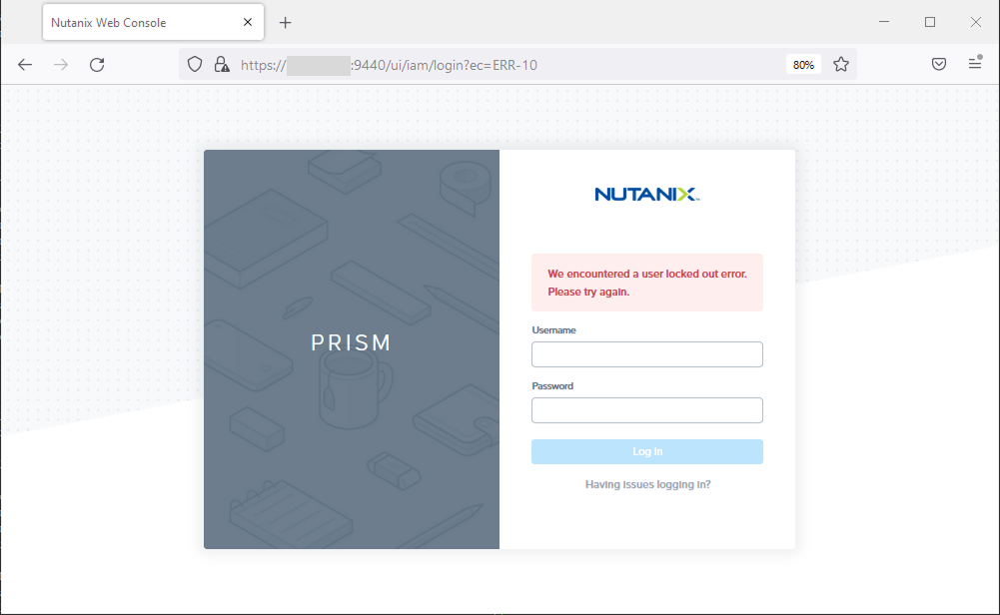
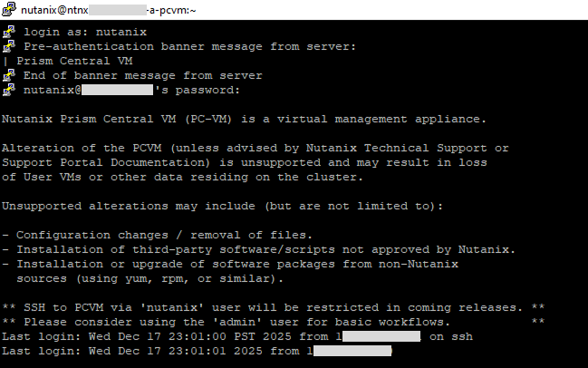
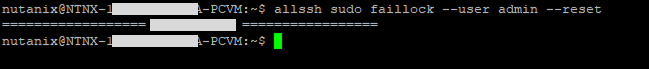
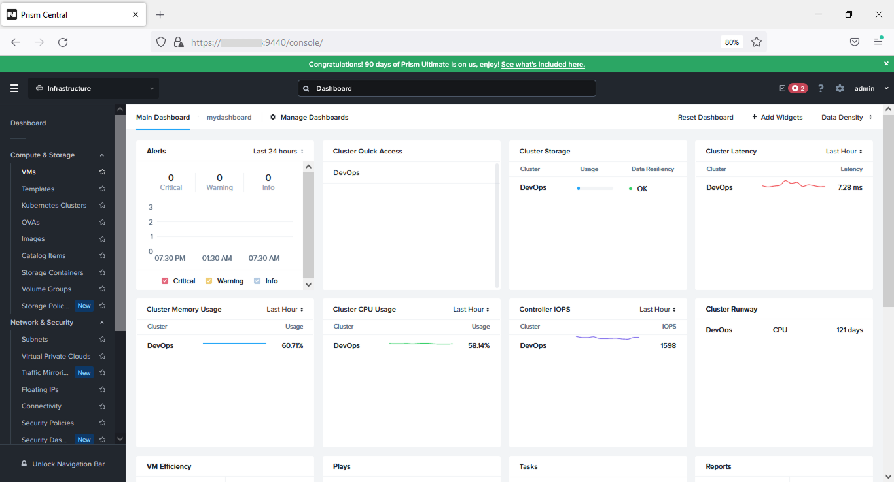

## Intro

When I try login to Nutanix Prism Central I got this error:

:::warning
We encountered a user locked out error. Please try again.
:::

This is caused by too many incorrect login attempt.



## Solution

SSH to Nutanix CVM and login as `nutanix`



Run this command to resetting (unlocking) the login failure lock for the `admin` user on all CVMs in the cluster

```bash
allssh sudo faillock --user admin --reset
```



Now try to login again, now you can view the Nutanix Prism Central again.

