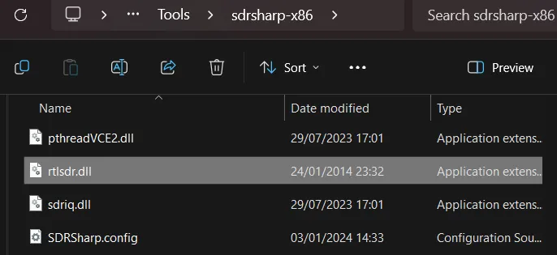
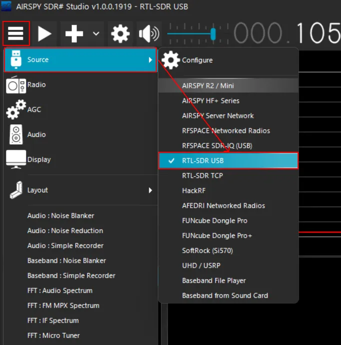
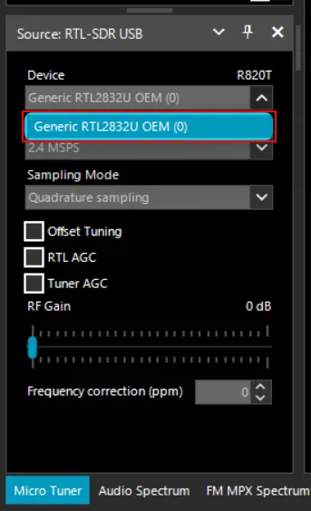
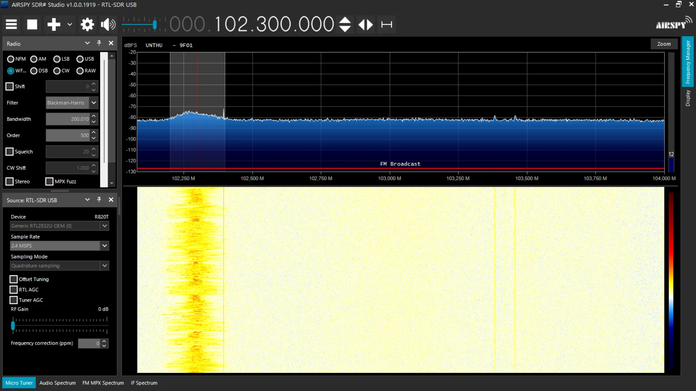

## Introduction

[Airspy SDR#](https://airspy.com/download/) is a software-defined radio (SDR) application that can be used to receive radio signals. This application is developed by [Airspy](https://airspy.com/).

## Prerequisite

You must already configure the USB driver using [Zadig](https://zadig.akeo.ie/). You can follow the steps in the [RTL-SDR.com guide](https://www.rtl-sdr.com/rtl-sdr-quick-start-guide/).

## Steps

### 1. Download the missing DLL file

You can download the missing DLL file from [here](https://s.id/RTL-SDR-DLL). In this case, we only need the `rtlsdr.dll` file.

### 2. Copy the `rtlsdr.dll` file to the SDR# folder

Copy the `rtlsdr.dll` file to the SDR# folder. Ex: `/path/to/sdrsharp-x86/`

### 3. Configure the RTL-SDR device in SDR#

Click the hamburger menu (☰) in the top left corner of the SDR# window. Then, click the `Source` button. Choose `RTL-SDR USB` in the `Source` dropdown menu.

Then choose `Generic RTL2832U OEM (0)` in the Device dropdown

### 4. Start the Airspy SDR# using the `play` button.

Press the `play` button to start listening to the radio signals.

## References

- [[SOLVED] : No device selected in SDRSharp program using SDR DVB-T+DVD+FM by Titof Abdellatif ANFLOUS @ YouTube](https://youtu.be/AN9GBDfy0W0?si=t3G0a3HeRdPnxOxU)
- [RTL-SDR Quick Start Guide](https://www.rtl-sdr.com/rtl-sdr-quick-start-guide/)