## Intro

[DNSSEC](https://en.wikipedia.org/wiki/Domain_Name_System_Security_Extensions "DNSSEC @ Wikipedia") is a security extension of [DNS](https://en.wikipedia.org/wiki/Domain_Name_System "Domain Name System (DNS) @ Wikipedia") that provides cryptographic authentication of DNS data. It helps to make sure the DNS data is not tampered or spoofed.

DNSSEC relies on a [chain of trust](https://en.wikipedia.org/wiki/Chain_of_trust "Chain of trust @ Wikipedia"), where each DNSSEC-enabled resolver validates the DNSSEC records of the authoritative DNS server, and so on, up to the root zone.

It helps to prevent [DNS cache poisoning](https://en.wikipedia.org/wiki/DNS_cache_poisoning) or [DNS spoofing](https://en.wikipedia.org/wiki/DNS_spoofing), and [DNS man-in-the-middle attacks](https://en.wikipedia.org/wiki/Man-in-the-middle_attack).

## Setup

### Cloudflare

1. Log in to [Cloudflare dashboard](https://dash.cloudflare.com)
2. Select your domain in "Domains" section
3. Select "DNS" in sidebar
4. Click on "Settings"
5. Enable DNSSEC

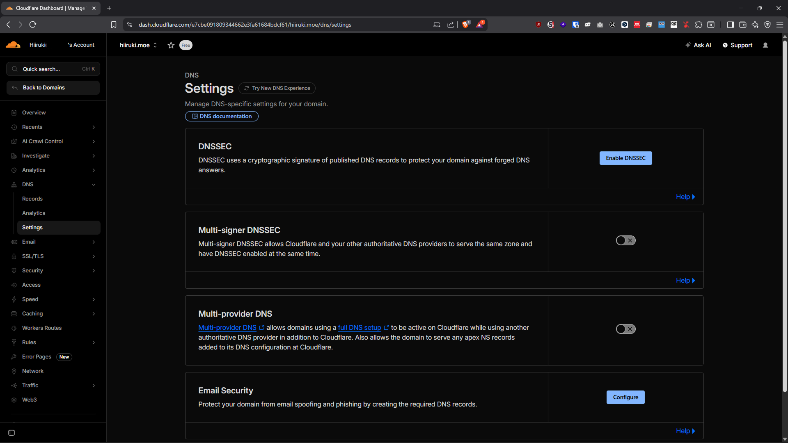

6. Copy the DS records

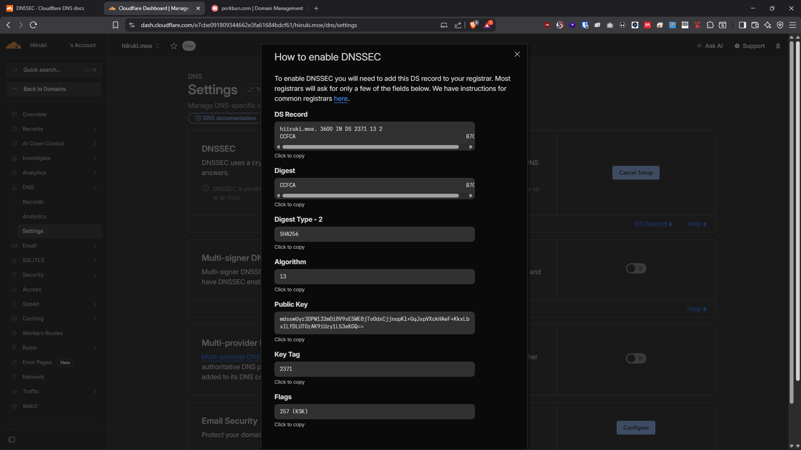

### Porkbun

1. Log in to [Porkbun dashboard](https://porkbun.com)
2. Select [Domain Management](https://porkbun.com/account/domains) in "ACCOUNT"
3. Edit the "REGISTRY DNSSEC" settings by clicking the "Edit" button

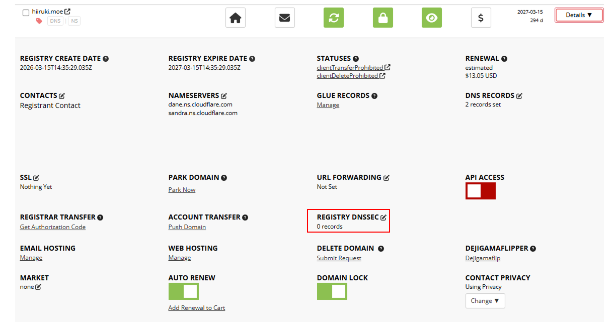

4. Fill in the DS records from Cloudflare

:::note
Do not fill out keyData.
Refer to the [Cloudflare DNSSEC Docs](https://developers.cloudflare.com/dns/dnssec/) on the Provider-specific DNSSEC instructions.

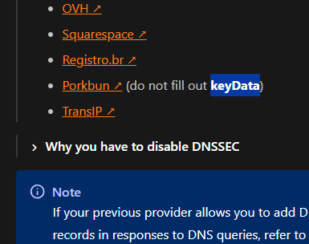
:::

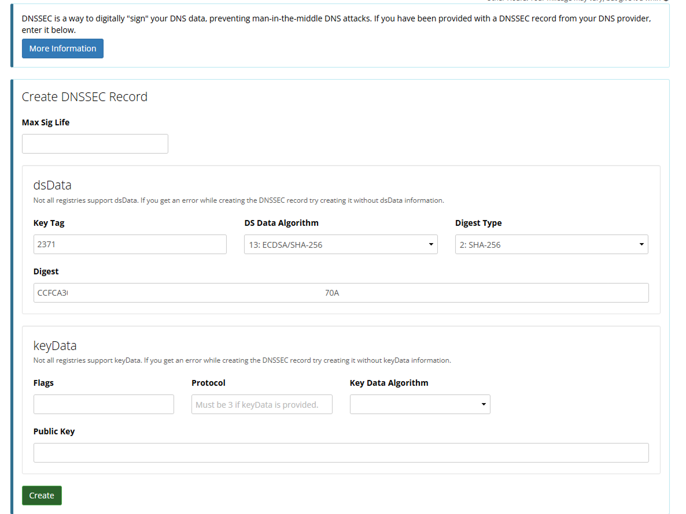

5. The final setup looks like this.

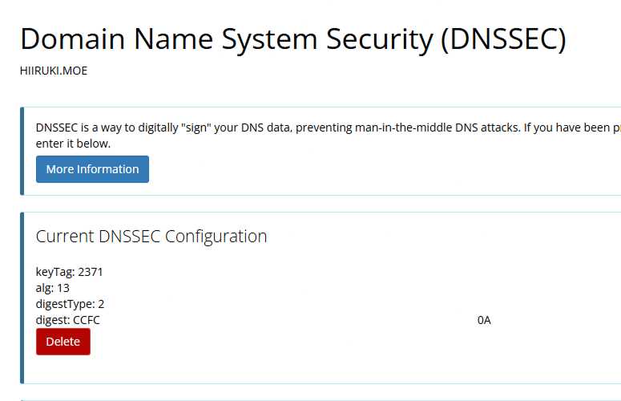

### DNSSEC Status in Cloudflare

Wait for the DNSSEC to be propagated, this will take some time. The DNSSEC status in Cloudflare will show as pending.

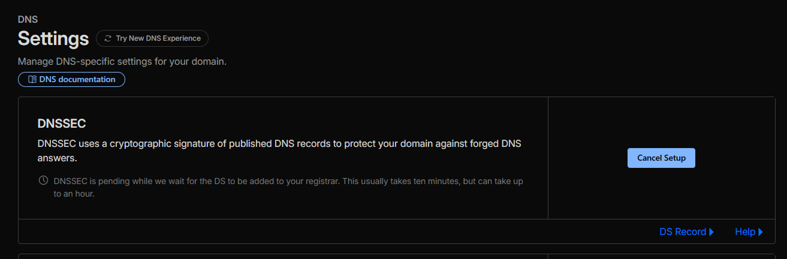

After setting it up in Porkbun, Cloudflare will automatically detect the changes and activate the DNSSEC in a few hours. The DNSSEC status in Cloudflare will change to **Success! [website-name] is protected with DNSSEC.** and the button will change to "Disable DNSSEC". 

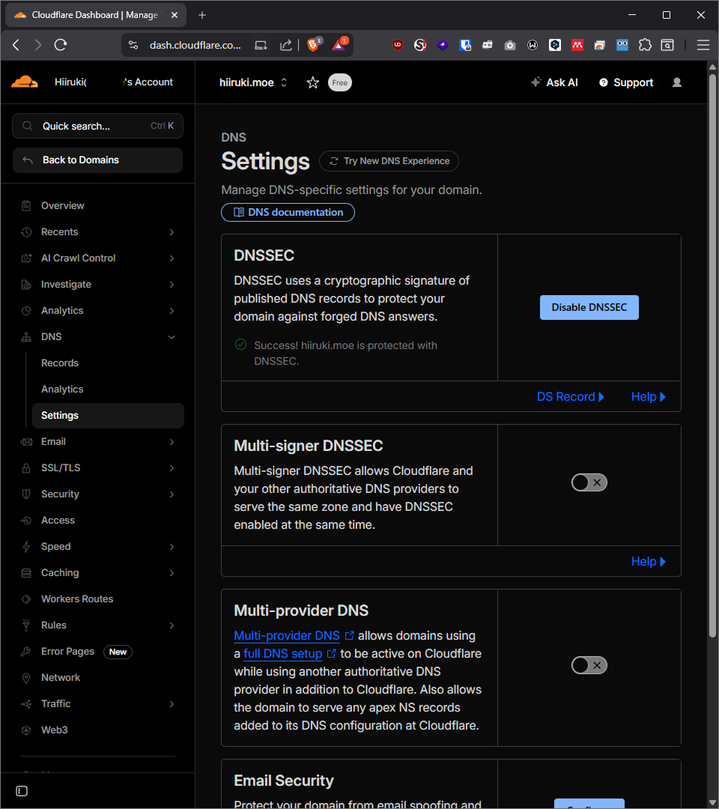

## Testing

You can use web-based tools to test DNSSEC, such as [DNSSEC Analyzer](https://dnssec-analyzer.verisignlabs.com/). The output for my domain looks like this:

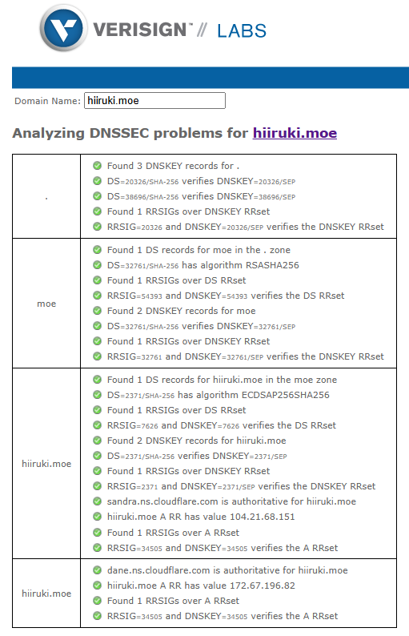


[DNSViz](https://dnsviz.net/) can also provide more detailed information about DNSSEC validation with better visualization. The output for my domain looks like this:

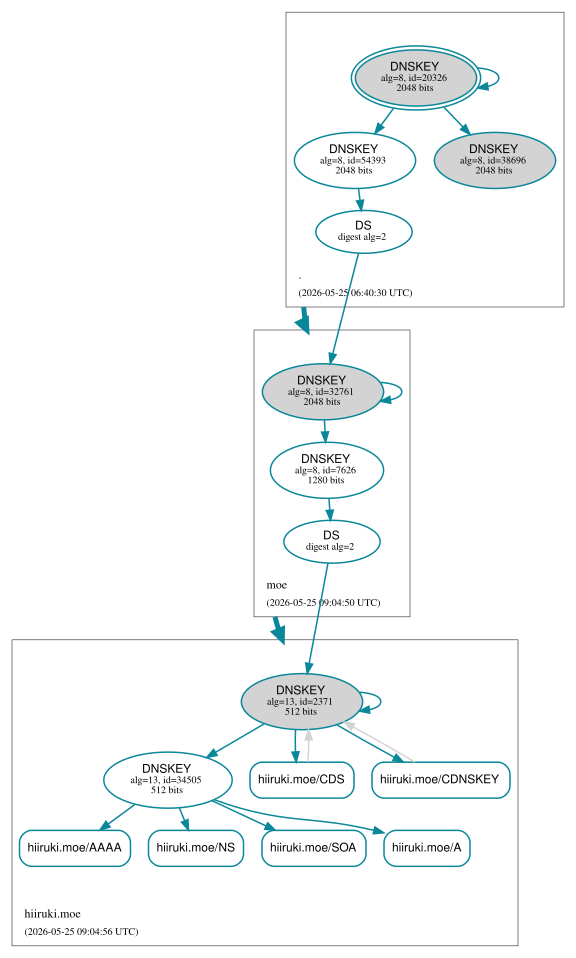

You can also use CLI or command line tools to check the RRSIG and other DNSSEC records, such as `dig` or `delv`:

```bash
dig +dnssec hiiruki.moe dnskey
```

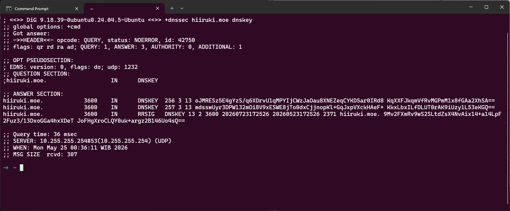

Make sure the output contains the `RRSIG` record, which is the signature of the DNS record, and the `ad` (Authenticated Data) flag.

Or using `delv` to validate DNSSEC locally:

```bash
delv hiiruki.moe
```

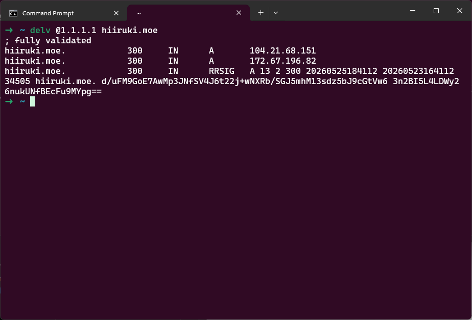

The correct output should show fully validated records with no errors, confirming that DNSSEC is working properly.

## References

- [DNSSEC @ Cloudflare Docs](https://developers.cloudflare.com/dns/dnssec/)
- [How to Install DNSSEC @ Porkbun Docs](https://kb.porkbun.com/article/93-how-to-install-dnssec)
- [DNSSEC in Porkbun with Cloudflare DNS by NAZAVO](https://nazavo.com/dnssec-in-porkbun-with-cloudflare-dns/)
- [DNS @ Wikipedia](https://en.wikipedia.org/wiki/Domain_Name_System)
