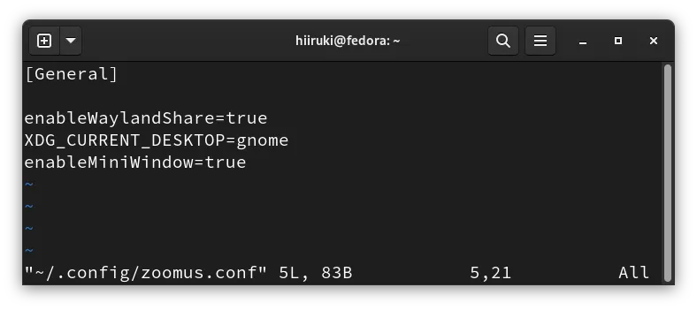
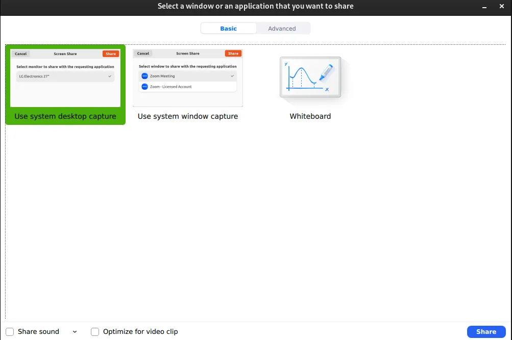
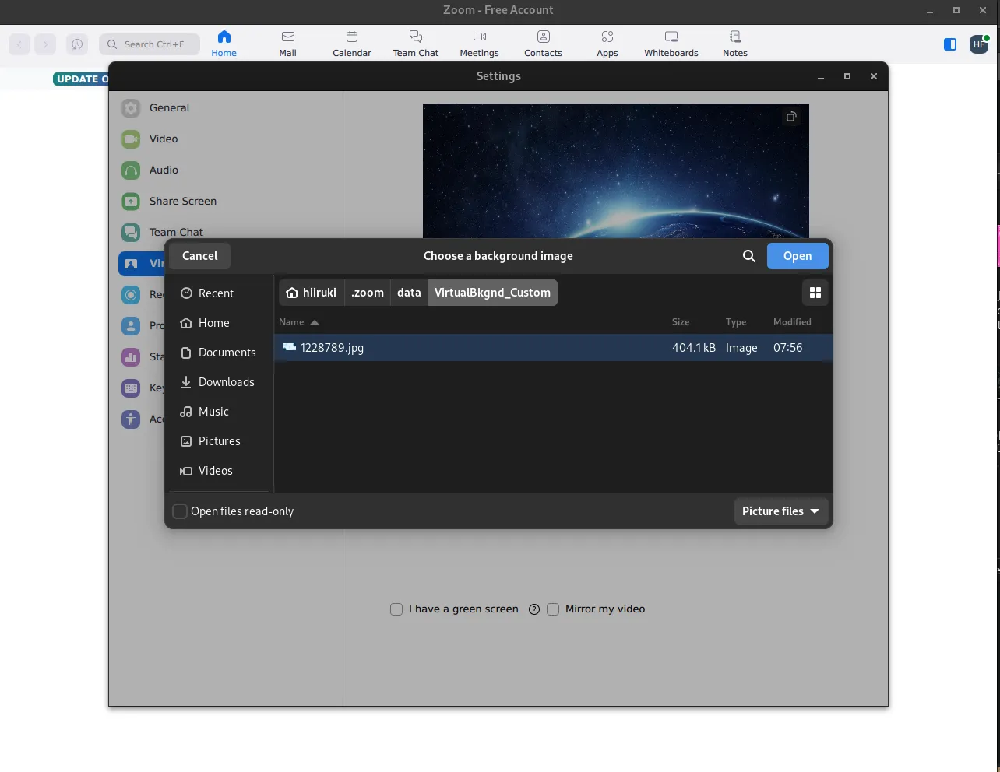
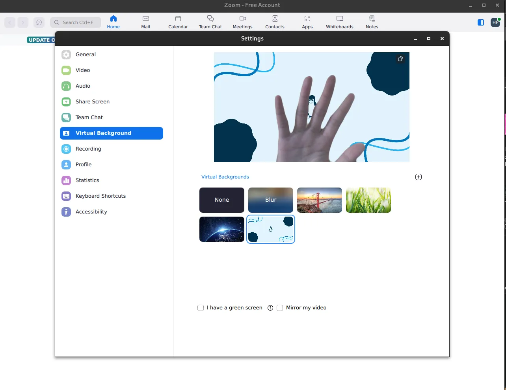

## Introduction

[Zoom](https://zoom.us/) is a video conferencing software that allows users to hold online meetings, training sessions, and webinars. It is available for Windows, macOS, Linux, iOS, and Android.

It is easy to install Zoom on Linux. However, if you are using a Wayland session, you may encounter some problems. In this article, I will show you how to install Zoom and setup it on Linux with Wayland session.

## Steps

### 1. Install Zoom

Download the latest Zoom package from [Zoom Download Center](https://zoom.us/download). Or you can get it from the Flatpak/Flathub repository.

### 2. Edit the Zoom Configuration File

Open the Zoom configuration file with your favorite text editor.

```bash typed   
$ vim ~/.config/zoomus.conf
```

or if you are using Flatpak version of Zoom, open the configuration file with the following command.

```bash typed
$ vim ~/.var/app/us.zoom.Zoom/config/zoomus.conf
```

Add the following line to the file.

```bash showLineNumbers title="zoomus.conf"
enableWaylandShare=true
enableMiniWindow=true
XDG_CURRENT_DESKTOP=gnome
```

For the other configuration options, please refer to [this thread](https://askubuntu.com/questions/1388053/what-are-all-of-the-available-zoomus-conf-options "What are all of the available zoomus.conf options? @ AskUbuntu").



:::note
If you are using other desktop environments, you need to change the value of `XDG_CURRENT_DESKTOP` to the name of your desktop environment.
:::



### 3. Fix Custom Virtual Background

Zoom saves the default virtual backgrounds to `~/.zoom/data/VirtualBkgnd_Default`. If you are using a custom virtual background, you may encounter a problem that the background is not loaded correctly. To fix this problem, you need to copy the custom virtual background to `~/.zoom/data/VirtualBkgnd_Custom`.






## Conclusion

To use Zoom on Linux with Wayland session, you need to edit the Zoom configuration `zoomus.conf` to able Wayland share and mini window. If you are using a custom virtual background, you need to copy it to `~/.zoom/data/VirtualBkgnd_Custom`. That's all. Thank you for reading.

## References

- [AskUbuntu](https://askubuntu.com/questions/1388053/what-are-all-of-the-available-zoomus-conf-options "What are all of the available zoomus.conf options? - Ask Ubuntu")
- [Zoom Meetings @ Arch Linux Wiki](https://wiki.archlinux.org/title/Zoom_Meetings)
- [Zoom @ Flathub](https://flathub.org/apps/us.zoom.Zoom)