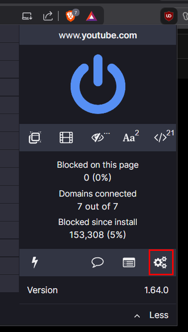
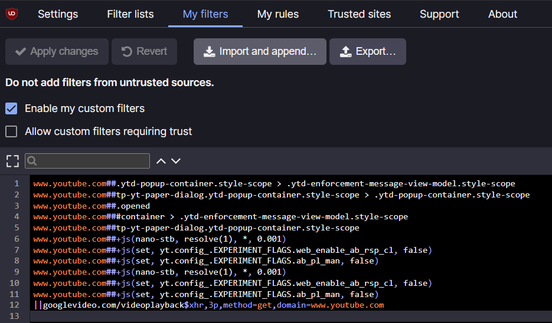

## Intro

This tricks will fix the YouTube "Ad blockers violate YouTube's Terms of Service" warning on [Brave](https://brave.com/) browser and by using the [uBlock Origin](https://ublockorigin.com/) extension

### Configure the uBlock Origin extension

1. Remove all existing adblock extensions on your browser.
2. Download the uBlock Origin extension for [Chrome](https://chrome.google.com/webstore/detail/ublock-origin/cjpalhdlnbpafiamejdnhcphjbkeiagm) or [Firefox](https://addons.mozilla.org/en-US/firefox/addon/ublock-origin/).
3. If you’re on Chrome, click on the puzzle icon.
4. Select “uBlock Origin” and click on the settings icon.



5. Click on the “My filters” tab.
6. Copy and paste the following code:

```bash
www.youtube.com##.ytd-popup-container.style-scope > .ytd-enforcement-message-view-model.style-scope
www.youtube.com##tp-yt-paper-dialog.ytd-popup-container.style-scope > .ytd-popup-container.style-scope
www.youtube.com##.opened
www.youtube.com###container > .ytd-enforcement-message-view-model.style-scope
www.youtube.com##tp-yt-paper-dialog.ytd-popup-container.style-scope
www.youtube.com##+js(nano-stb, resolve(1), *, 0.001)
www.youtube.com##+js(set, yt.config_.EXPERIMENT_FLAGS.web_enable_ab_rsp_cl, false)
www.youtube.com##+js(set, yt.config_.EXPERIMENT_FLAGS.ab_pl_man, false)
www.youtube.com##+js(nano-stb, resolve(1), *, 0.001)
www.youtube.com##+js(set, yt.config_.EXPERIMENT_FLAGS.web_enable_ab_rsp_cl, false)
www.youtube.com##+js(set, yt.config_.EXPERIMENT_FLAGS.ab_pl_man, false)
||googlevideo.com/videoplayback$xhr,3p,method=get,domain=www.youtube.com
```



7. Click on “Apply changes”, try refreshing the page and watch some YouTube videos.

## Reference

- https://www.reddit.com/r/Adblock/comments/1l45afe/fuckers_are_at_it_again/
- https://www.reddit.com/r/Adblock/comments/1l21d8m/heres_a_working_youtube_adblocker_for_when_ublock/